# Basic Active Directory Setup Activity

## 🎯 Objectives
The primary objective of this project is to architect and deploy a foundational Windows Active Directory (AD) domain from scratch. 

*Note: A proper DNS and DHCP infrastructure will not be implemented during this initial phase. These core network services will be manually configured in a future project module.*

This activity covers the following deployment milestones:
* Installing the Active Directory Domain Services (AD DS) role on Windows Server 2022.
* Promoting the standalone server to a Domain Controller (DC) to establish a new forest and root domain (e.g., `JeddrickPablico.local`).
* Architecting a logical hierarchy using Organizational Units (OUs) to represent distinct departments (e.g., IT, HR, Sales).
* Provisioning manual user accounts and assigning security groups within the directory structure.

---

## ⚙️ Prerequisites & Server Preparation
Before installing the AD DS role, the server environment must be properly staged. This implementation is executed on a Windows Server 2022 instance hosted within a VMware Workstation virtual machine. Ensure your VM is configured with a static IP address prior to beginning the installation.

---

## 🛠️ Phase 1: Installing Active Directory on Windows Server 2022

Installing the AD DS role places the necessary binaries and management tools onto your server. It is the first step before the server can actively manage network identities.

**1.1** To begin, launch the **Server Manager**. This is the central administrative console for Windows Server. You can find it by typing "Server Manager" into the Start menu search bar.

  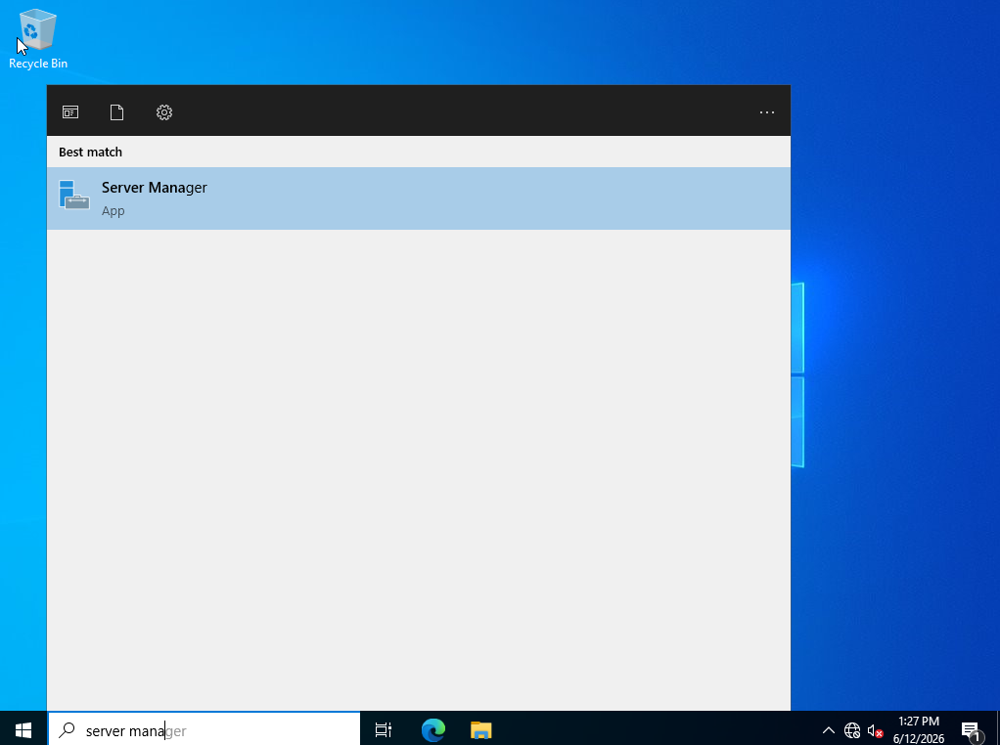

<i>Figure 1.1: Launching the Server Manager application.</i>

**1.2** Once the Server Manager dashboard loads, look to the top right corner. Click on **Manage**, and then select **Add Roles and Features** from the drop-down menu. 

  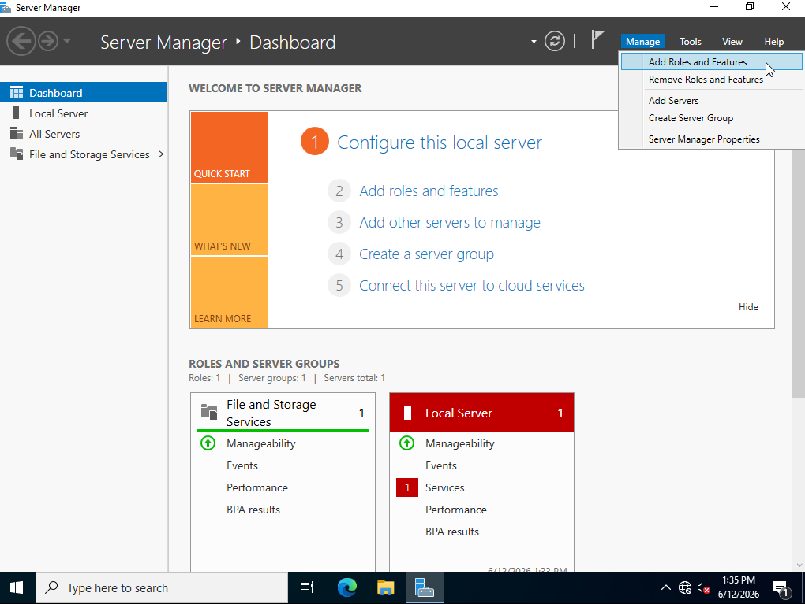

<i>Figure 1.2: Navigating to the Add Roles and Features Wizard.</i>

**1.3** The wizard's introductory screen (Figure 1.3) will appear. Click **Next** to proceed, leaving the default **Role-based or feature-based installation** option selected until you reach the **Server Roles** tab.

  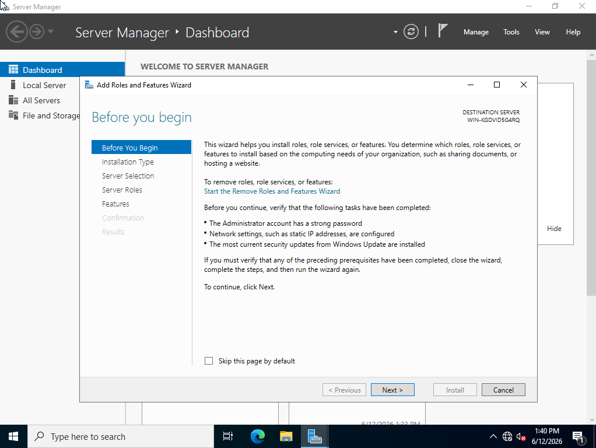

<i>Figure 1.3: Proceeding through the installation type and server selection.</i>

**1.4** In the Server Roles list, check the box for **Active Directory Domain Services**. This is the core service responsible for authenticating users, applying security policies, and storing network resource data.

  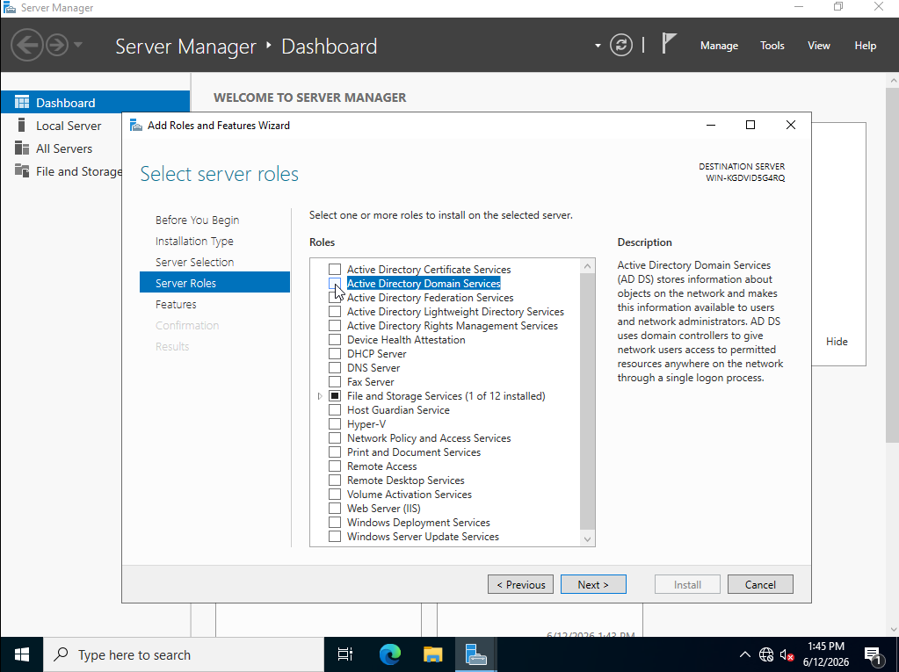

<i>Figure 1.4: Selecting the AD DS role.</i>

**1.5** As soon as you select AD DS, a secondary window will prompt you to install required management tools (such as the Remote Server Administration Tools, or RSAT). Click **Add Features** to include these necessary components.

  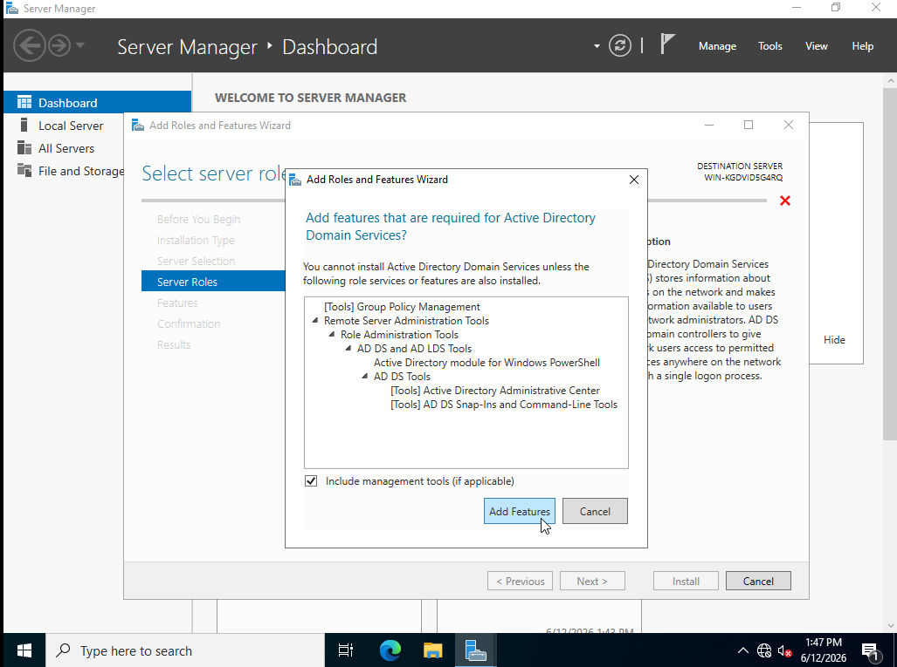

<i>Figure 1.5: Adding required AD DS administrative features.</i>

**1.6** While our primary focus is AD DS, we will also prepare the server for future networking labs. Check the box for **Remote Access** (used for VPN and routing capabilities). *Note: We will install the DNS and DHCP server roles in a separate, dedicated tutorial.* Click **Next**.

  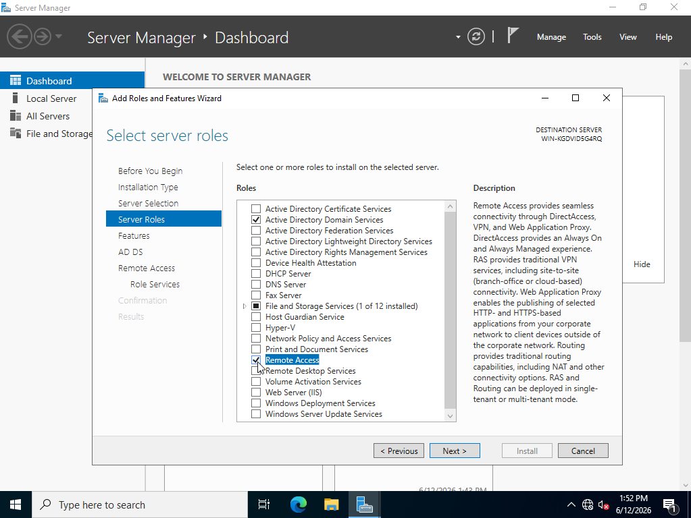

<i>Figure 1.6: Selecting the Remote Access role for future lab modules.</i>

**1.7** In the Features tab, ensure that **Group Policy Management** is checked. This crucial feature allows administrators to deploy security configurations and scripts across the entire domain. Click **Next**.

  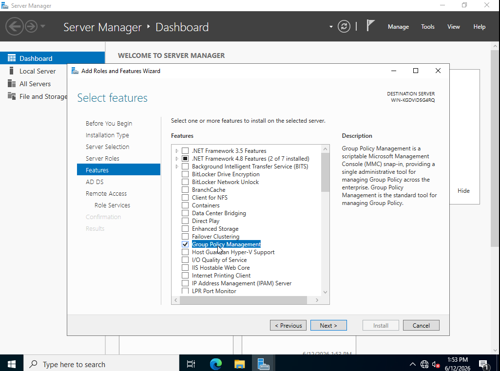

<i>Figure 1.7: Verifying Group Policy Management is selected.</i>

**1.8** Continue clicking **Next** through the informational screens. Once you arrive at the specific Role Services configuration for Remote Access, ensure the necessary checkboxes (such as DirectAccess and VPN) are selected, click **Add Features** if prompted again, and proceed.

  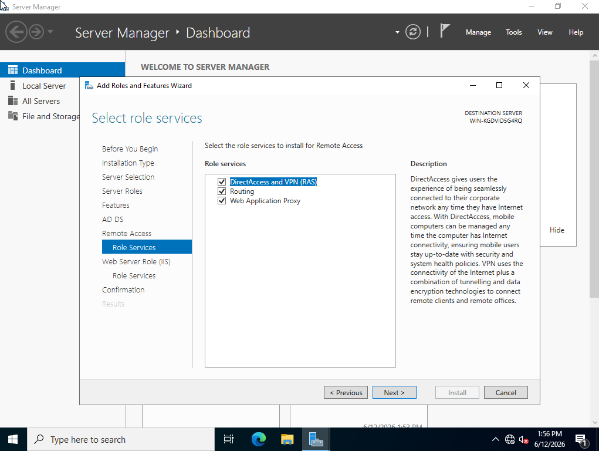

<i>Figure 1.8: Configuring Role Services for Remote Access.</i>

**1.9** Review your selections on the **Confirmation** screen and click **Install**. The installation process will take a few minutes to copy the binaries to your system. **Crucial Step:** Once the progress bar is full, DO NOT close the wizard. 

  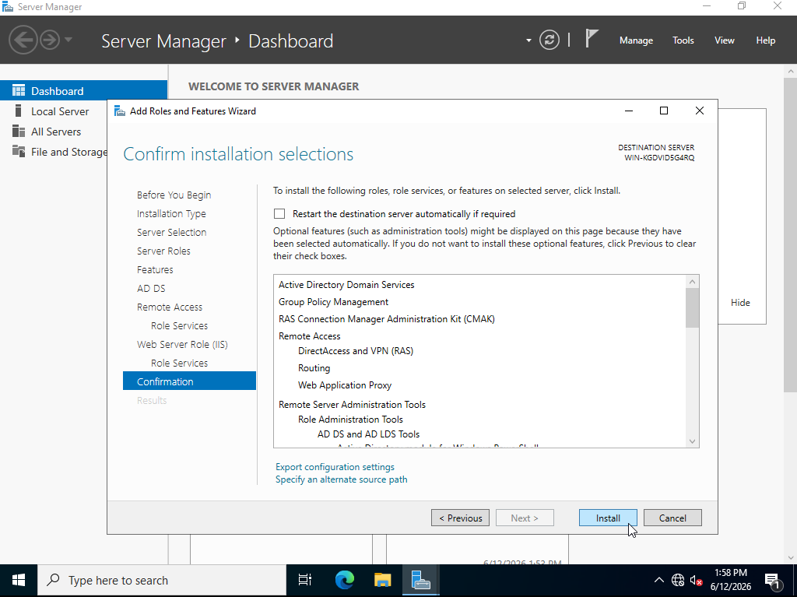

<i>Figure 1.9: Finalizing the role installation.</i>

---

## 🚀 Phase 2: Promoting the Server to a Domain Controller

Installing the AD DS role does not automatically make the server a Domain Controller. Promotion is the process that generates the Active Directory database (`NTDS.DIT`) and establishes the server's authority over the network.

**2.1** With the installation wizard still open, look for the alert link indicating that configuration is required. Click the hyperlink text that reads **Promote this server to a domain controller**.

  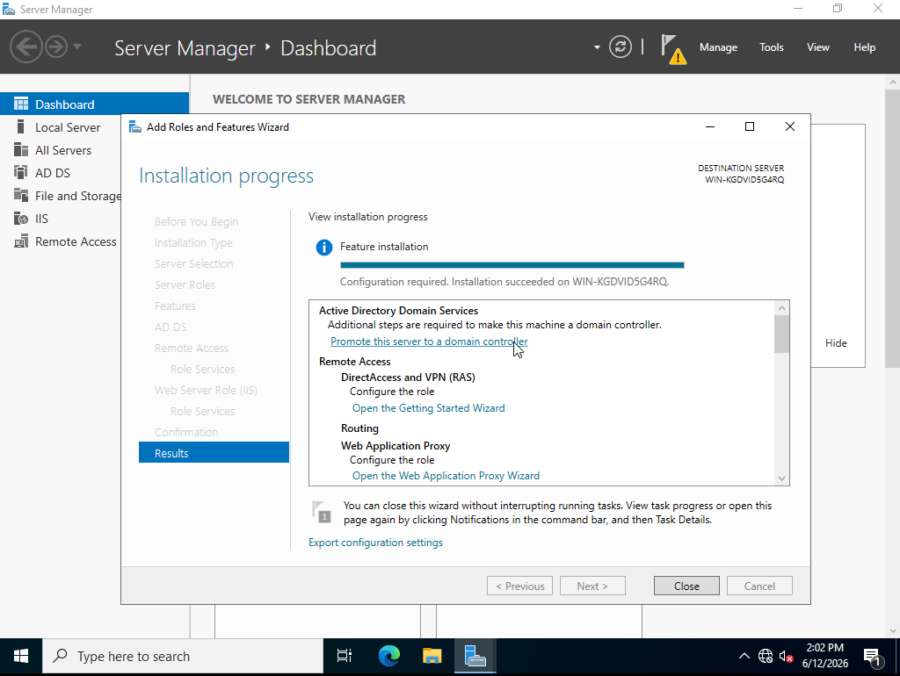

<i>Figure 2.1: Initiating the Active Directory Domain Services Configuration Wizard.</i>

**2.2** In the Deployment Configuration window, select **Add a new forest**, as we are building this environment from scratch. Enter your desired root domain name (e.g., `JeddrickPablico.local`). 
* *Note:* Using a `.local` suffix is a standard best practice for isolated, private homelabs to prevent routing conflicts with live internet domains. Click **Next**.

  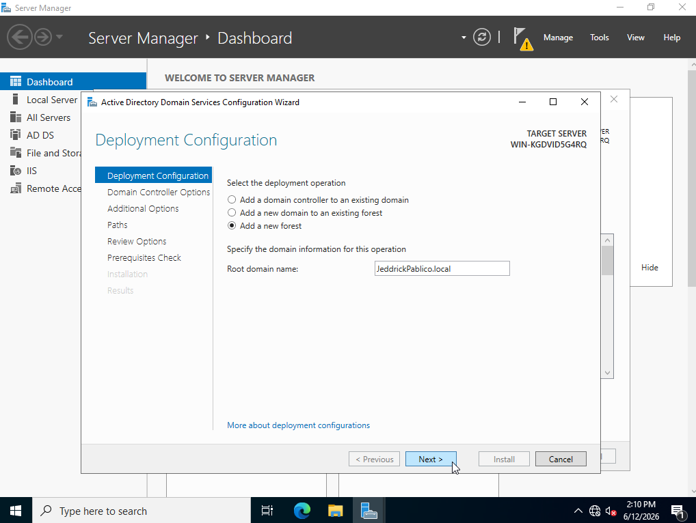

<i>Figure 2.2: Defining the new AD forest and root domain name.</i>

**2.3** Leave the functional levels at their default settings. You will be required to create a **Directory Services Restore Mode (DSRM)** password. Make sure this is a secure, memorable password. DSRM acts as an offline "Safe Mode" specifically for Active Directory, allowing an administrator to repair or recover a corrupted database. Click **Next**.

  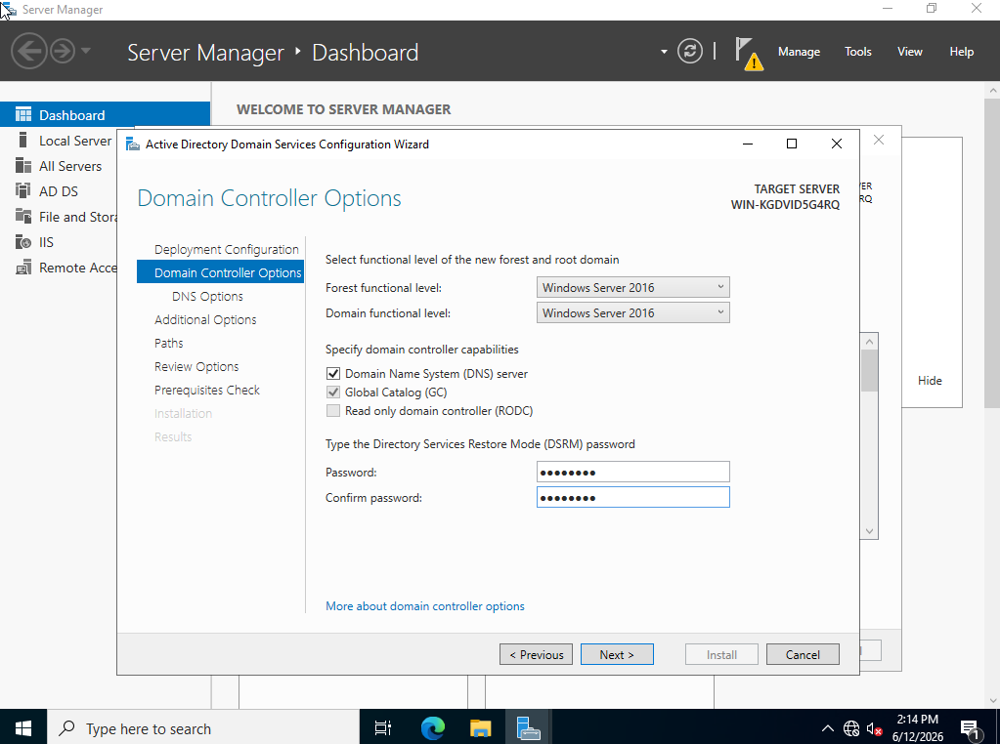

<i>Figure 2.3: Securing the directory with a DSRM password.</i>

**2.4** Active Directory is fundamentally dependent on DNS to function. However, because our lab objectives state that we will manually set up a standalone DNS Server in a future tutorial, leave the DNS delegation option **unchecked** for now and click **Next**.

  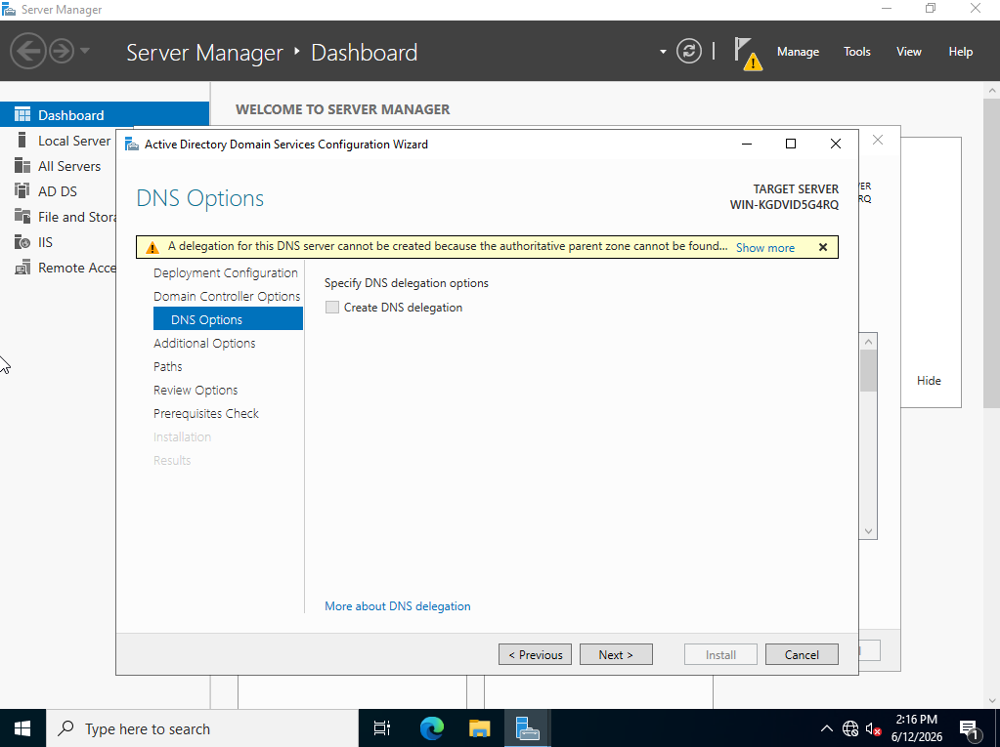

<i>Figure 2.4: Bypassing DNS delegation for future manual configuration.</i>

**2.5** The wizard will automatically generate a NetBIOS domain name (e.g., `JEDDRICKPABLICO`). This is a legacy, flat naming convention required to support older applications and operating systems. Leave it as the default and click **Next**.

  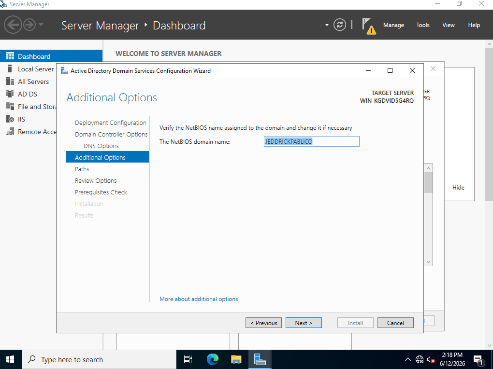

<i>Figure 2.5: Accepting the auto-generated NetBIOS name.</i>

**2.6** Proceed through the database path selections (leaving the default `C:\Windows\NTDS` locations) and review your choices. The wizard will execute a **Prerequisites Check** to ensure the server meets all technical requirements. Once you see the green checkmark indicating a successful pass, click **Install**. 

*The server will now promote itself, build the directory partitions, and automatically reboot to apply the new Domain Controller identity.*

  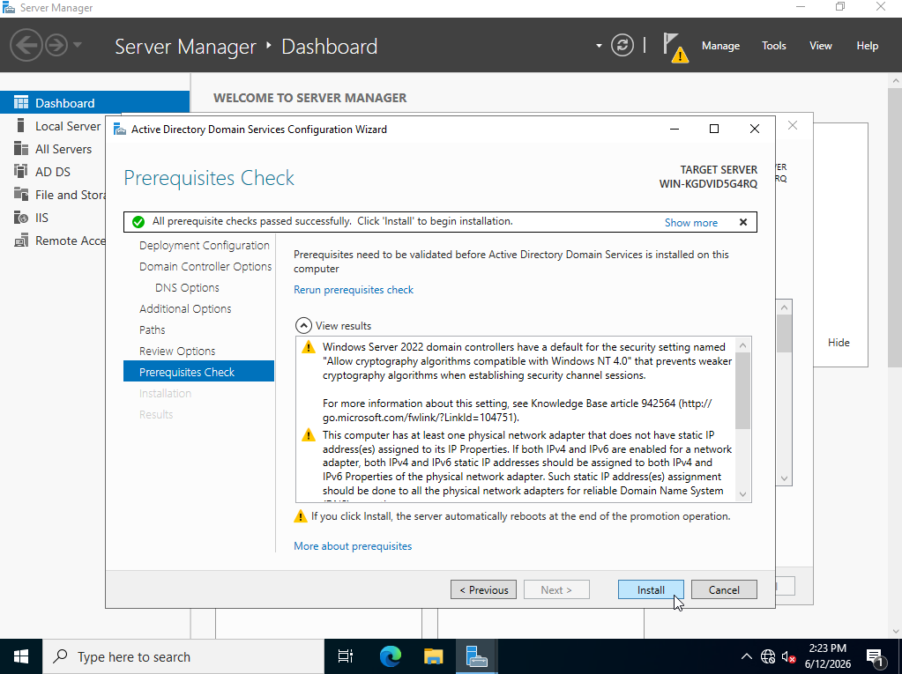

<i>Figure 2.6: Passing the prerequisite check and beginning the promotion.</i>

**2.7** Once the server has rebooted, you will notice that the login screen now displays your domain name prefixing the administrator account (e.g., `JEDDRICKPABLICO\Administrator`). Log in using your administrator password to access the newly established domain environment.

  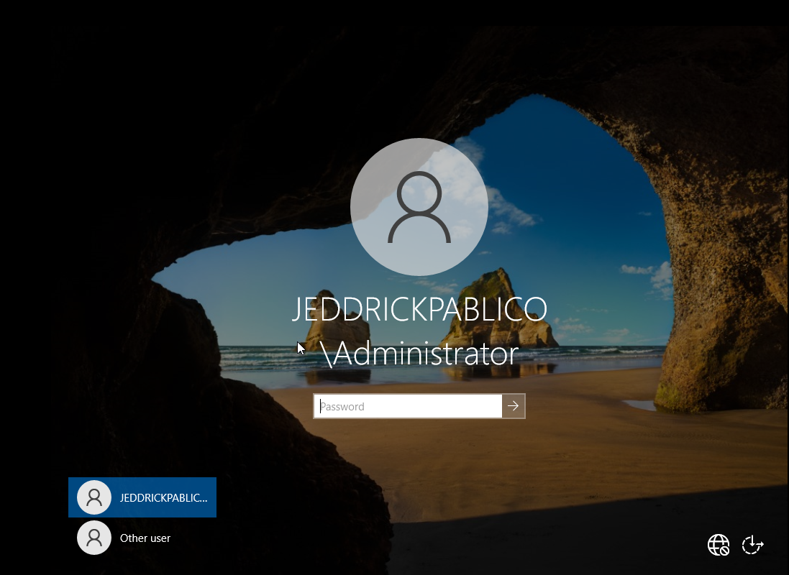

<i>Figure 2.7: Verifying the domain identity at the Windows Server login screen.</i>

**2.8** To verify that the Active Directory management utilities are successfully installed, open the Start menu and navigate to **Windows Administrative Tools** (or search for it directly in the taskbar). From the list of tools, launch **Active Directory Users and Computers (ADUC)**. This console will be the primary interface for managing network objects.

  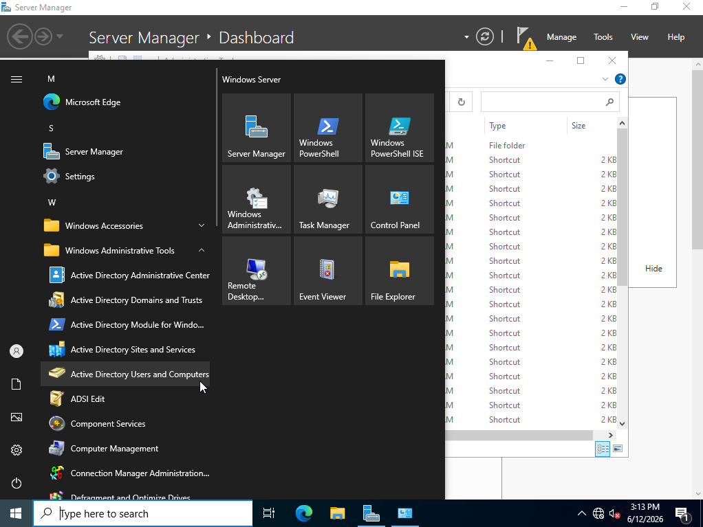

<i>Figure 2.8: Launching Active Directory Users and Computers from Administrative Tools.</i>

---

## 📁 Phase 3: Architecting a Logical Hierarchy using Organizational Units (OUs)

Before creating user accounts, it is crucial to establish a logical directory structure. Active Directory utilizes **Organizational Units (OUs)** to achieve this. An OU acts as a container—much like a standard file folder—that holds various network objects such as users, computers, servers, and groups. 

Structuring OUs correctly is a foundational security practice. It allows administrators to easily apply Group Policy Objects (GPOs) and cleanly delegate administrative permissions to specific segments of the company without granting blanket domain access.

### 3.1 Establishing Top-Level and Nested OUs
A standard enterprise best practice is to structure the directory geographically, followed by object categories. 

**3.1.1 Top-Level OUs (Geography):** To create your first container, right-click your domain name in ADUC, hover over **New**, and select **Organizational Unit**.

  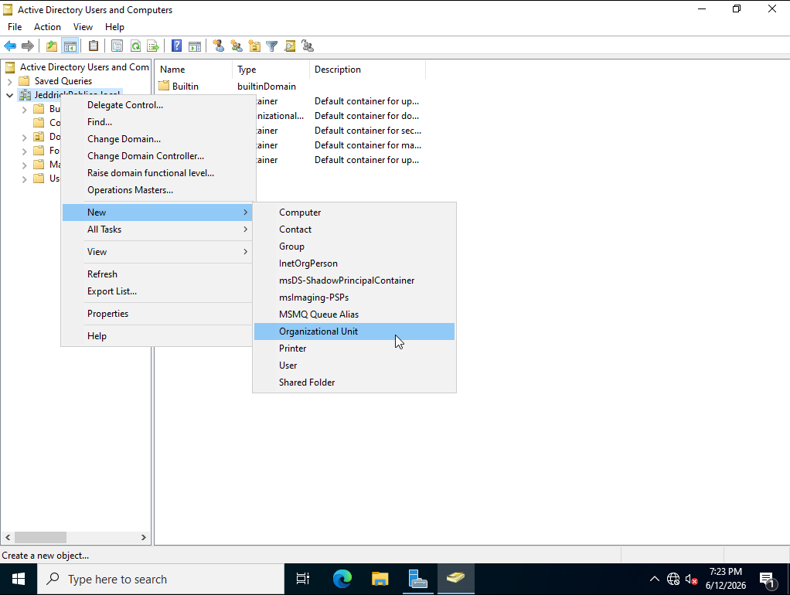

<i>Figure 3.1.1: Initiating the creation of a Top-Level OU.</i>

**3.1.2** In the New Object dialog box, type `USA` for the name and click **OK**. *(Note: Keep the "Protect container from accidental deletion" box checked as a safety measure).*

  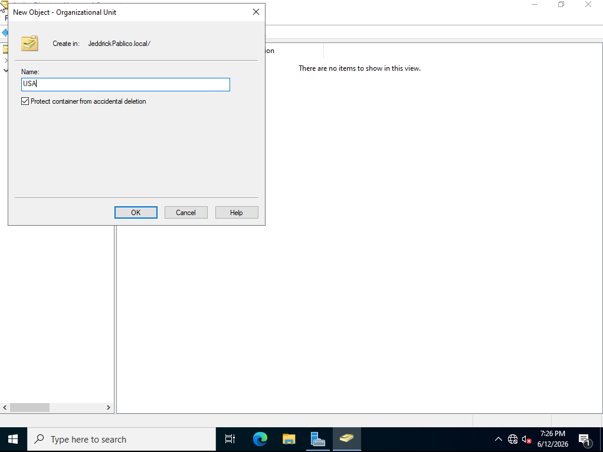

<i>Figure 3.1.2: Naming the USA Top-Level OU.</i>

**3.1.3** Repeat this exact process to establish containers for your other primary regions, such as `Europe` and `Asia`.

  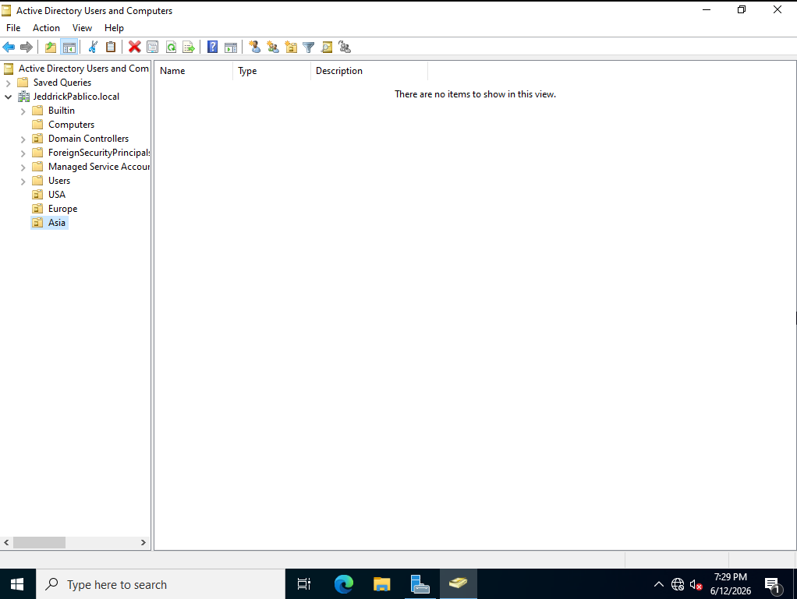

<i>Figure 3.1.3: Completed geographic top-level directory structure.</i>

**3.1.4 Nested OUs (Object Types):** Grouping all objects directly inside a geographic OU becomes unmanageable at scale. Instead, inside the `USA` OU, create nested sub-OUs to categorize the assets. Typical nested OUs include:
   * **Computers:** For standard employee workstations.

  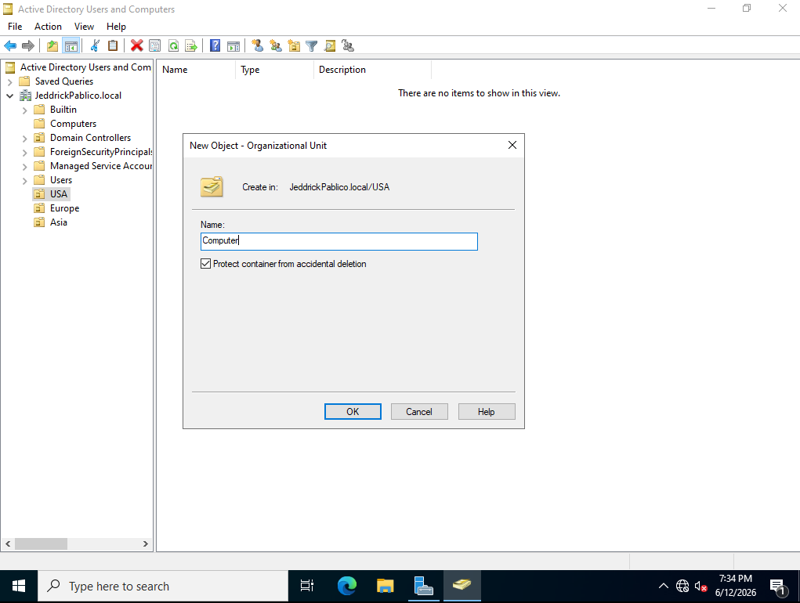

<i>Figure 3.1.4.a: Creating a nested "Computers" OU inside the USA container.</i>

   * **Servers:** For infrastructure assets.
   * **Users:** For employee accounts.
   
Repeat this internal nesting structure for the remaining geographic OUs to maintain a uniform architecture across the domain.

  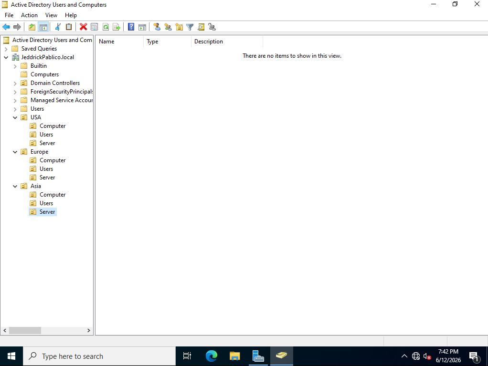

<i>Figure 3.1.4.b: Fully deployed nested OU architecture across all regions.</i>

---

### 3.2 Understanding Group Scopes and Types
Once the OU structure is built, we create **Groups** within the departmental `Users` OUs to organize employees. When creating a new Group, Active Directory requires you to define its **Scope** and **Type**.

**Group Scopes (Where the group is applied):**
* **Domain Local:** Used to assign permissions directly to local domain resources (like a specific shared folder or printer). 
* **Global:** Used to group users based on their department or role (e.g., grouping IT staff together). Global groups are then placed inside Domain Local groups to grant them access. This is the most common scope for departmental grouping.
* **Universal:** Used in complex, enterprise-level environments spanning multiple domains, allowing users from one domain to access resources located in an entirely different domain.

  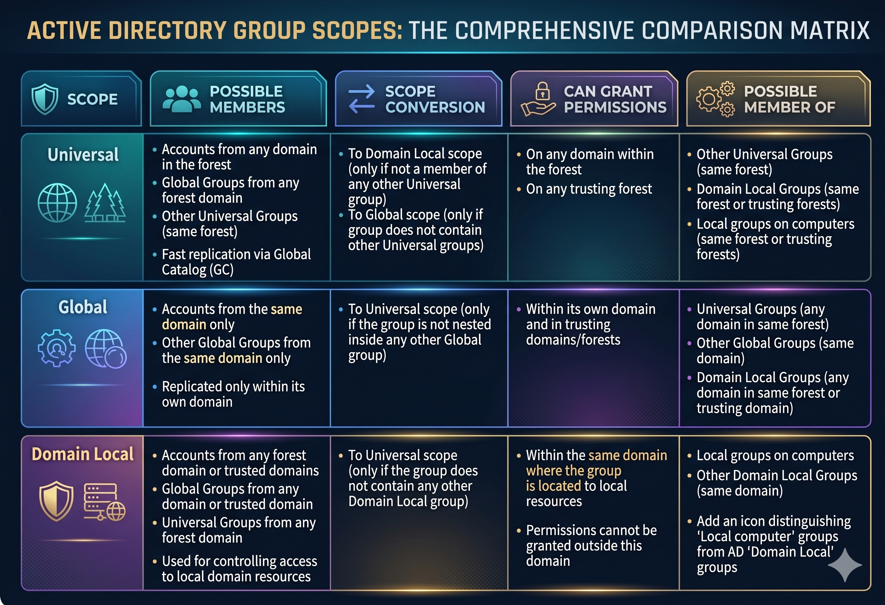

<i>Figure 3.2.a: Active Directory Group Scopes.</i>

**Group Types (What the group does):**
* **Security Groups:** Used to assign permissions and user rights to shared network resources. 
  * *Example:* Giving a "Finance" Security Group read/write access to financial folders, or utilizing Built-in Security Groups (like *Domain Admins* or *Remote Desktop Users*) to grant broad administrative control.
    

  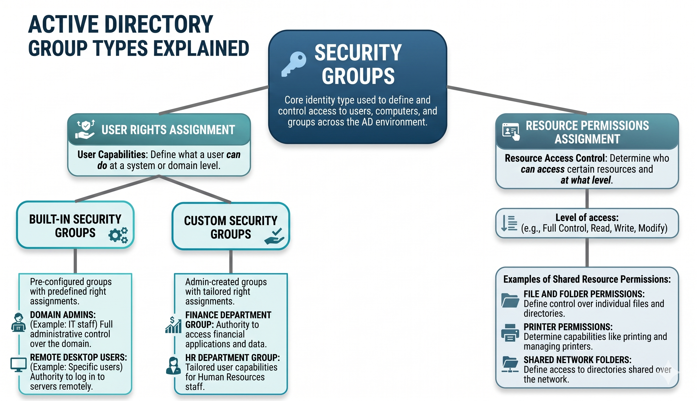

<i>Figure 3.2.b: Active Directory Security Groups.</i>

* **Distribution Groups:** Used exclusively for email distribution lists. These groups do *not* possess Security Identifiers (SIDs) and cannot grant network access permissions.
  * *Example:* Creating a `DL-IT Admins` or `All Employees` Distribution Group so an Exchange server can route mass communications to specific collections of people.

  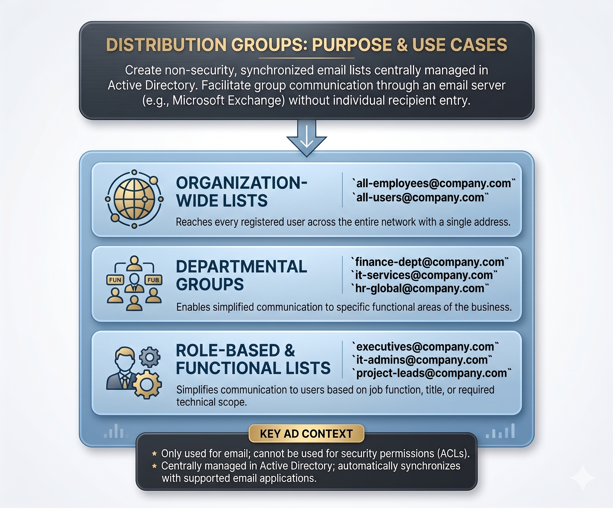

<i>Figure 3.2.c: Active Directory Distribution Groups.</i>

#### Creating the Groups

**3.2.1** To create a new group, right-click on your designated `Users` OU, hover over **New**, and click on **Group**.

  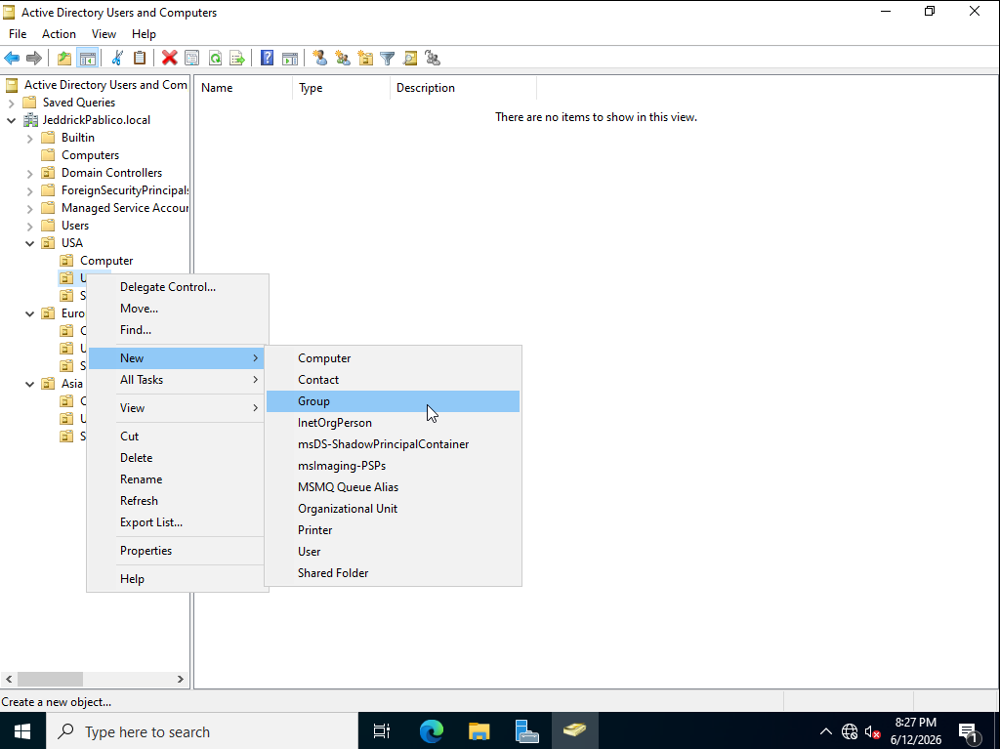

<i>Figure 3.2.1: Initiating Group creation within the Users OU.</i>

**3.2.2** In the dialog box, type `IT` (or your desired department) as the **Group name**. Ensure the Group scope is set to **Global** and the Group type is set to **Security**, then click **OK**.

  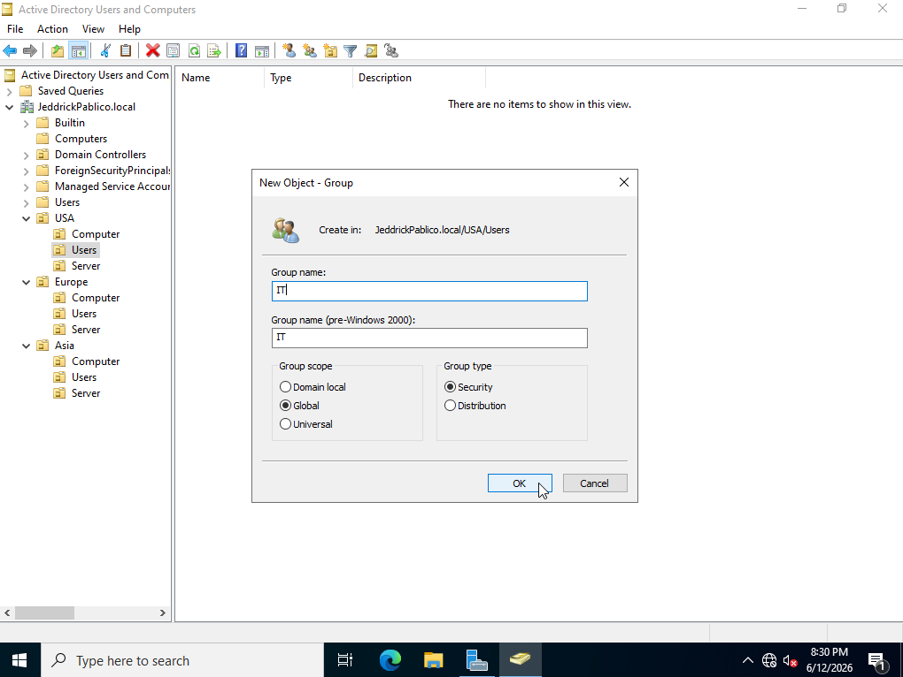

<i>Figure 3.2.2: Naming the IT Security Group.</i>

**3.2.3** To create an email mailing list, initiate the same group creation process, but change the **Group type** to **Distribution**. 

  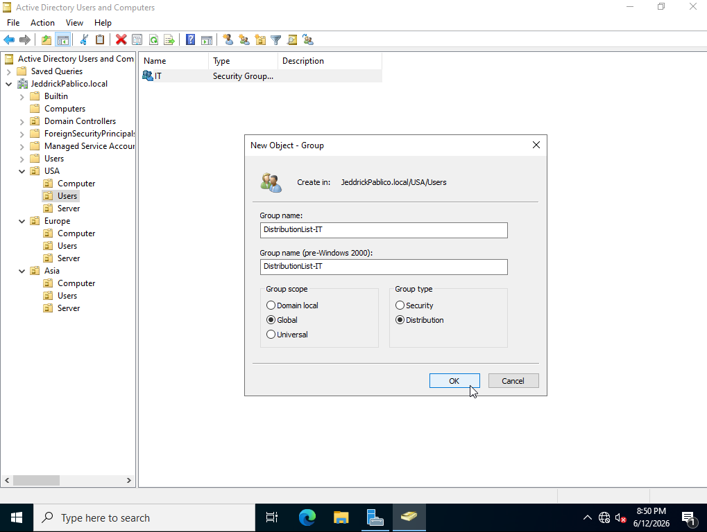

<i>Figure 3.2.3: Creating a Distribution List for IT Staff communications.</i>

--- 

## 👥 Phase 4: Provisioning User Accounts and Assigning Security Groups

With the directory architecture and security groups securely in place, user accounts can now be provisioned. 

*Note: In Active Directory, it is a strict best practice to utilize **Role-Based Access Control (RBAC)**. This means you should never assign resource permissions directly to a single user. Instead, you assign users to Groups, and give permissions to those Groups. This makes offboarding, onboarding, and auditing infinitely easier.* 

*(Note on Automation: In modern enterprise environments, manual user creation is rarely done. Bulk user provisioning is typically automated using **PowerShell scripts** that pull data directly from HR databases to ensure accuracy and save time. However, for the sake of simplicity in this foundational lab, we will be creating users manually. Automated PowerShell scripting will be covered in future tutorials.)*

**4.1 Creating the User Object:** Navigate to the specific departmental or regional `Users` OU where the employee belongs. Right-click the empty space, select **New**, and choose **User**.

  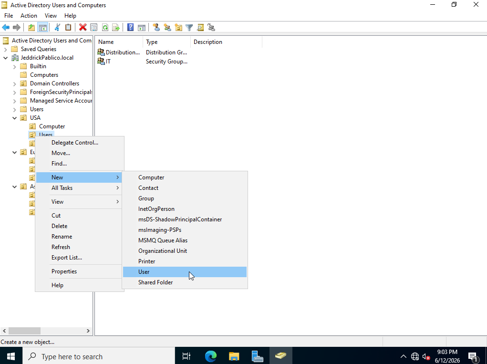

<i>Figure 4.1: Initiating manual user creation within a designated OU.</i>

**4.2 Defining Credentials:** Fill in the required user identity parameters (First Name, Last Name). For the **User logon name** (the UPN prefix), utilize a standard corporate naming convention, such as `first.last` or `firstinitial+lastname` (e.g., `john.doe`). Click **Next**.

  

<i>Figure 4.2: Establishing the user's primary logon identity.</i>

**4.3 Securing the Account:** Assign a temporary complex password. Ensure the **"User must change password at next logon"** checkbox is selected. This is a critical security mandate that prevents the IT administrator from knowing the user's permanent password. Click **Next** and then **Finish**.

  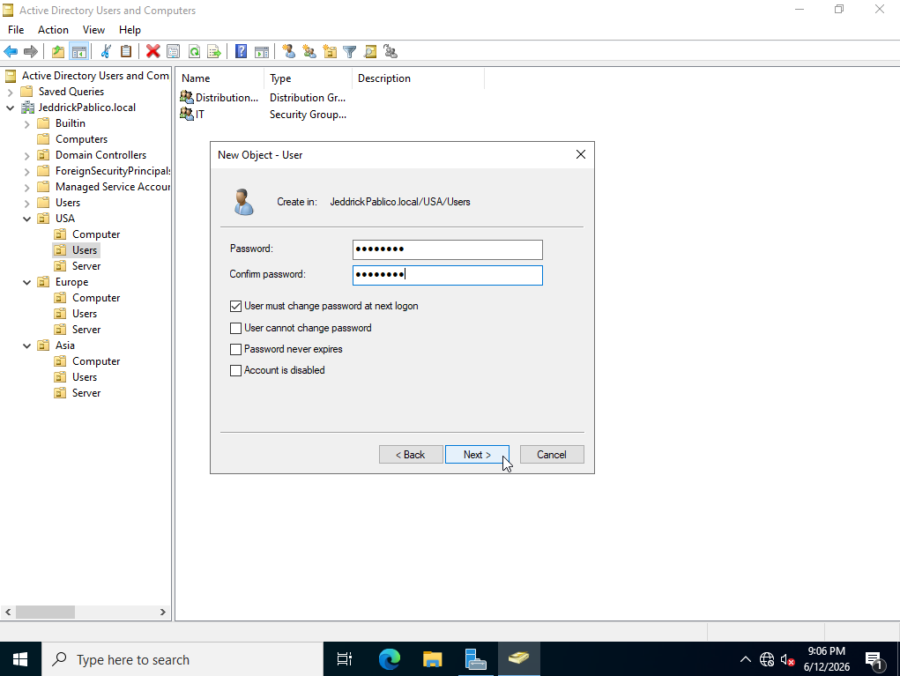

<i>Figure 4.3: Enforcing initial account security policies.</i>

**4.4 Assigning Group Membership:** The user account now exists, but the user currently lacks access to departmental resources. To fix this, right-click the newly created user profile and select **Add to a group...**.

  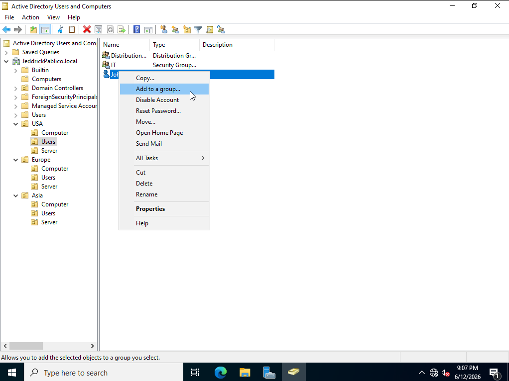

<i>Figure 4.4: Opening the group assignment context menu.</i>

**4.5 Finalizing Access:** In the object selection box, type the name of the departmental Security or Distribution group you created in Phase 3 (e.g., `IT`). Click **Check Names** to validate the group (the name will become underlined), then click **OK** to successfully grant the user their required network permissions.

  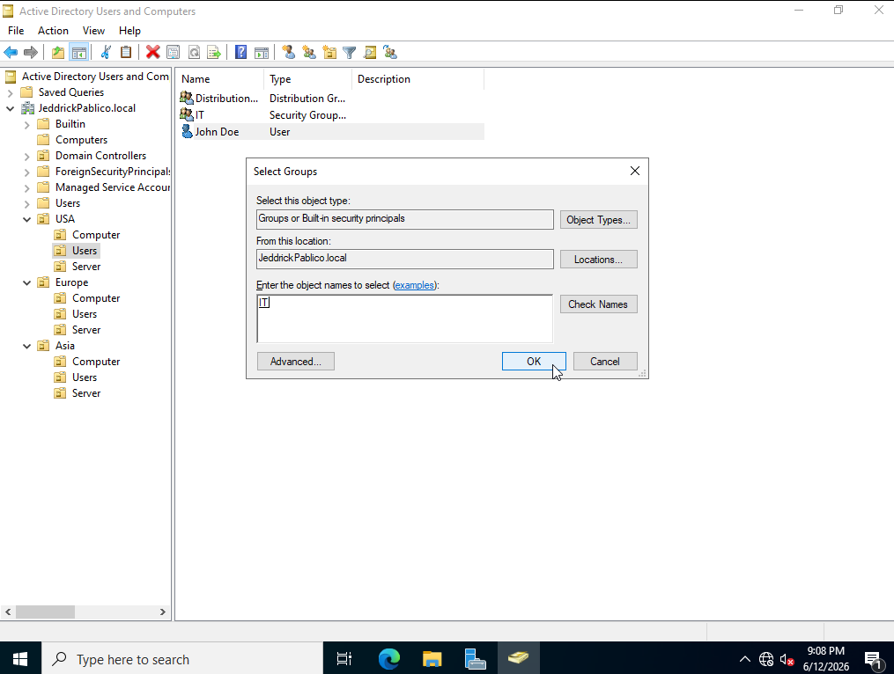

<i>Figure 4.5: Resolving the group name and finalizing user permissions.</i>

## 💻 Phase 5: Joining a Client Virtual Machine to the Domain

The final step is to test our new Active Directory setup by making sure a separate computer can successfully log in using the user accounts we just created.

In this phase, we will utilize a separate client virtual machine running concurrently with our Windows Server 2022 instance. **Crucial OS Requirement:** The client operating system must have the native capability to join a corporate domain. This means you must use an enterprise-grade version of Windows, such as:
*   **Windows 10/11 Pro**
*   **Windows 10/11 Enterprise**
*   **Windows 10/11 Education**

*(Note: Standard **Windows Home** editions completely block domain-joining features and cannot be used for this step).*

To ensure the client machine can communicate reliably with the directory, we will configure the Windows Server to have a permanent static IP address first. Once the server's network profile is locked down, we will configure this client's network adapter to utilize our Domain Controller as its primary DNS server, establish a connection to the `JeddrickPablico.local` domain, and finally, log in using the specific user credentials provisioned in Phase 4. This process confirms that the Domain Controller is actively resolving DNS queries, managing network identities, and securely handling remote authentication requests across the homelab environment.

---

### 5.1 Configuring a Static IP Address on the Windows Server

**5.1.1** Right-click the network/computer icon in the system tray (located at the bottom-right corner of your taskbar) and click **Open Network & Internet settings**.

  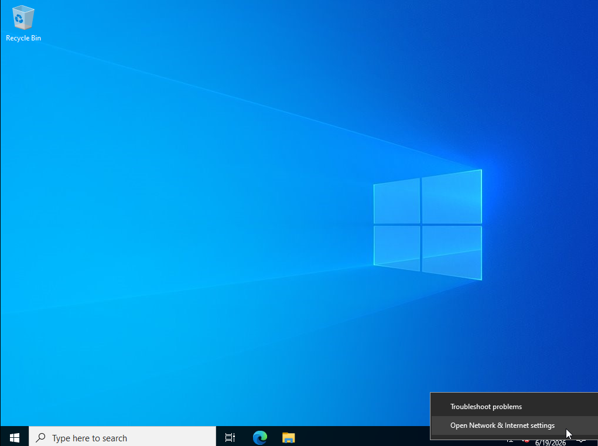

<i>Figure 5.1.1: Navigating to Network & Internet Settings.</i>

**5.1.2** Under the advanced network settings, click **Change adapter options**.

  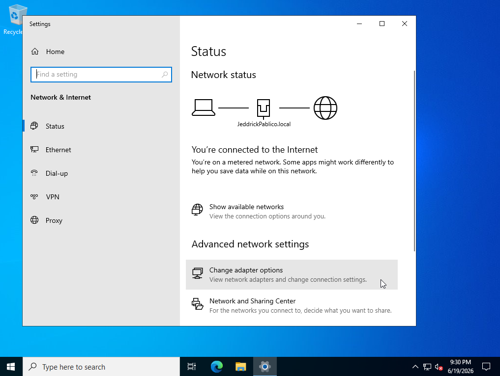

<i>Figure 5.1.2: Accessing the advanced network adapter settings.</i>

**5.1.3** Right-click on your primary active **network adapter** (e.g., `Ethernet0`) and select **Properties**.

  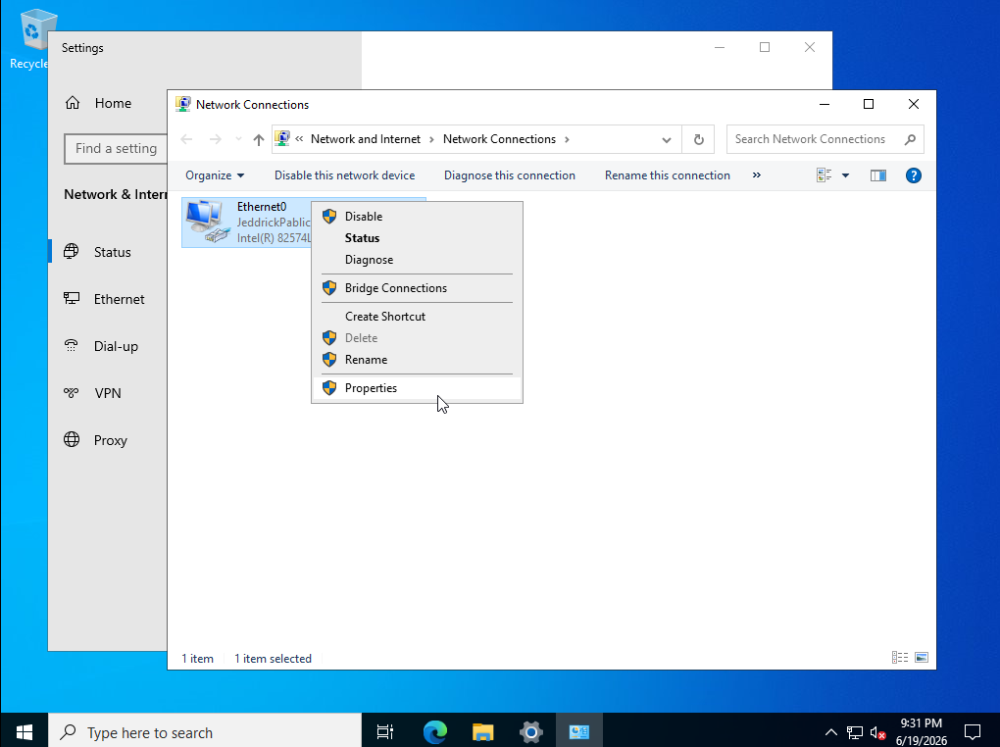

<i>Figure 5.1.3: Opening the network adapter properties.</i>

**5.1.4** In the list of connection items, highlight **Internet Protocol Version 4 (TCP/IPv4)** and click the **Properties** button.

  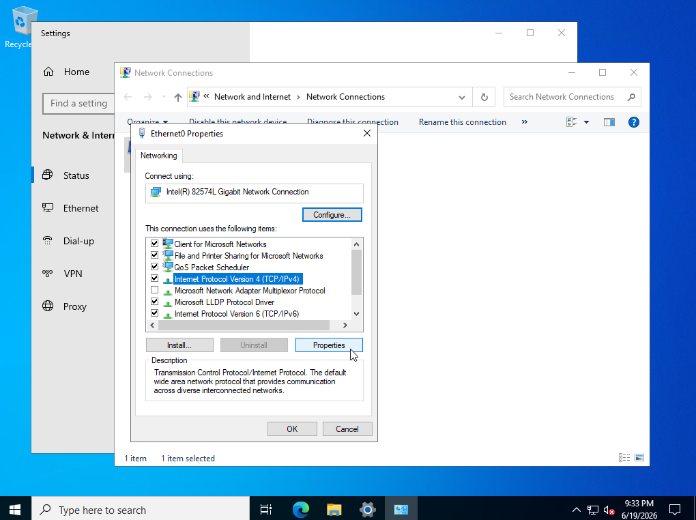

<i>Figure 5.1.4: Accessing the IPv4 configuration properties.</i>

**5.1.5** To keep this homelab environment simple, we will not architect an entirely new subnet. Instead, we will capture the current dynamic IP address provided by your virtual machine manager's DHCP server, and convert that exact IP into a permanent static assignment. 

To find this information, open **Command Prompt**, type `ipconfig`, and hit **Enter**. Record the following outputs:
*   **IPv4 Address** *(e.g., in my lab, it is `192.168.2.91`)*
*   **Subnet Mask** *(e.g., `255.255.255.0`)*
*   **Default Gateway** *(e.g., `192.168.2.1`)*

  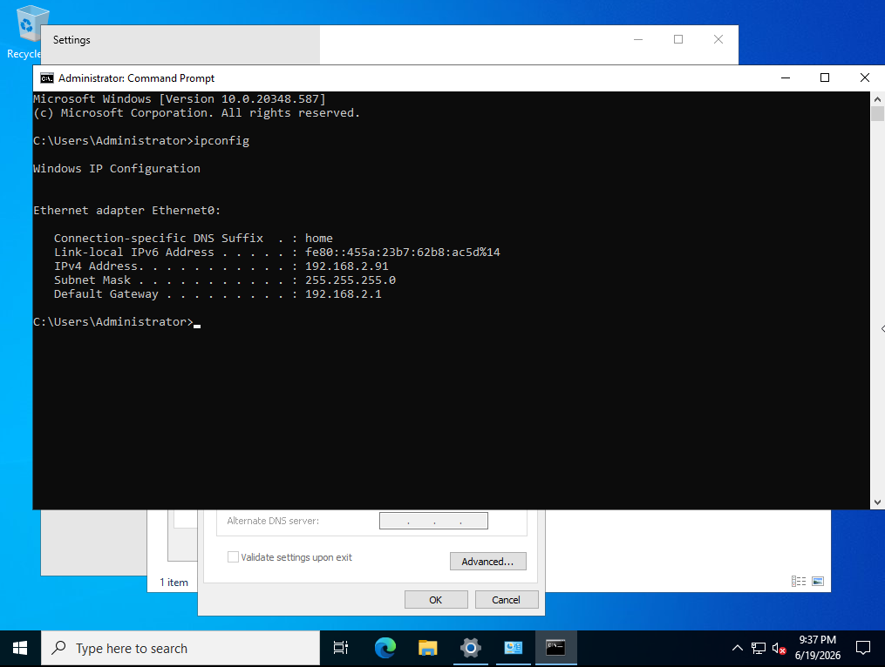

<i>Figure 5.1.5: Using ipconfig to determine the current DHCP lease configuration.</i>

**5.1.6** Return to the **Internet Protocol Version 4 (TCP/IPv4) Properties** window. Select **"Use the following IP address"** and input the IPv4 Address, Subnet mask, and Default gateway you recorded in the previous step. 

Next, configure the DNS servers:
*   **Preferred DNS server:** Enter `127.0.0.1`. This is the loopback address. Because this server is acting as the Domain Controller, it is also the authoritative DNS server for the network. Setting the DNS to loopback tells the server to query itself to resolve internal domain requests.
*   **Alternate DNS server:** Enter `8.8.8.8` (Google's Public DNS). This acts as a fallback forwarder, allowing the server to resolve external web traffic so it can still access the internet.

Click **OK** to apply the static configuration.

  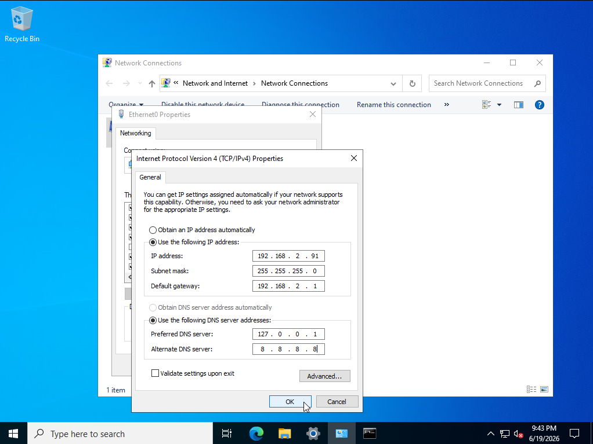

<i>Figure 5.1.6: Assigning the static IP and DNS configurations.</i>

> ⚠️ **Enterprise Context: Real-World Practices vs. Homelab Configuration**
> 
> While the configuration above is perfectly suited for a functional homelab, it introduces several operational and security risks that would violate enterprise standards. If you were deploying this in a production environment, you would need to adjust the following:
> 
> **1. The Public DNS Risk (Do not put `8.8.8.8` on the NIC)**
> * **The Risk:** Active Directory relies entirely on DNS to locate services (via SRV records). If your server queries `8.8.8.8` (Google) for an internal AD query, Google will not know what `JeddrickPablico.local` is, and the query will fail. Furthermore, if your primary loopback DNS temporarily times out, the server will default to Google, breaking domain authentication and leaking your internal namespace structure to the public internet.
> * **The Enterprise Solution:** The network adapter's DNS settings should *only* point to internal Domain Controllers. To allow the server to reach the outside internet, you configure **DNS Forwarders** within the DNS Server Management Console. The internal DNS server will handle AD requests locally, and explicitly forward unknown/external requests (like `google.com`) to `8.8.8.8`.
>
> **2. Static IP vs. DHCP Scope Conflicts**
> * **The Risk:** In step 5.1.5, we "stole" a dynamic IP from the DHCP server and made it static. Because the DHCP server does not know we permanently claimed this IP, it might attempt to lease `192.168.2.91` to a newly connected device in the future. This creates an **IP Conflict**, instantly knocking the Domain Controller offline.
> * **The Enterprise Solution:** Static IPs for critical infrastructure (Servers, Domain Controllers, network switches) are always assigned strictly *outside* of the active DHCP scope, or they are locked down on the DHCP server using a MAC Address Reservation. 
>
> **3. Single Point of Failure (High Availability)**
> * **The Risk:** This lab builds a single Domain Controller. If this single virtual machine crashes or becomes corrupted, the entire network goes down. No users can log in, DNS resolution stops, and all shared resources become inaccessible.
> * **The Enterprise Solution:** A production environment will always deploy at minimum **two** Domain Controllers (e.g., `DC01` and `DC02`). They continuously replicate the Active Directory database between each other. If `DC01` goes offline, `DC02` seamlessly takes over authentication and DNS requests.

**5.1.7** To verify that your network settings were applied correctly, return to the Command Prompt and execute the command `ipconfig /all`. Review the output to ensure that the IPv4 Address, Subnet Mask, Default Gateway, and specifically the DNS Servers precisely match the static values you configured in the previous steps.

  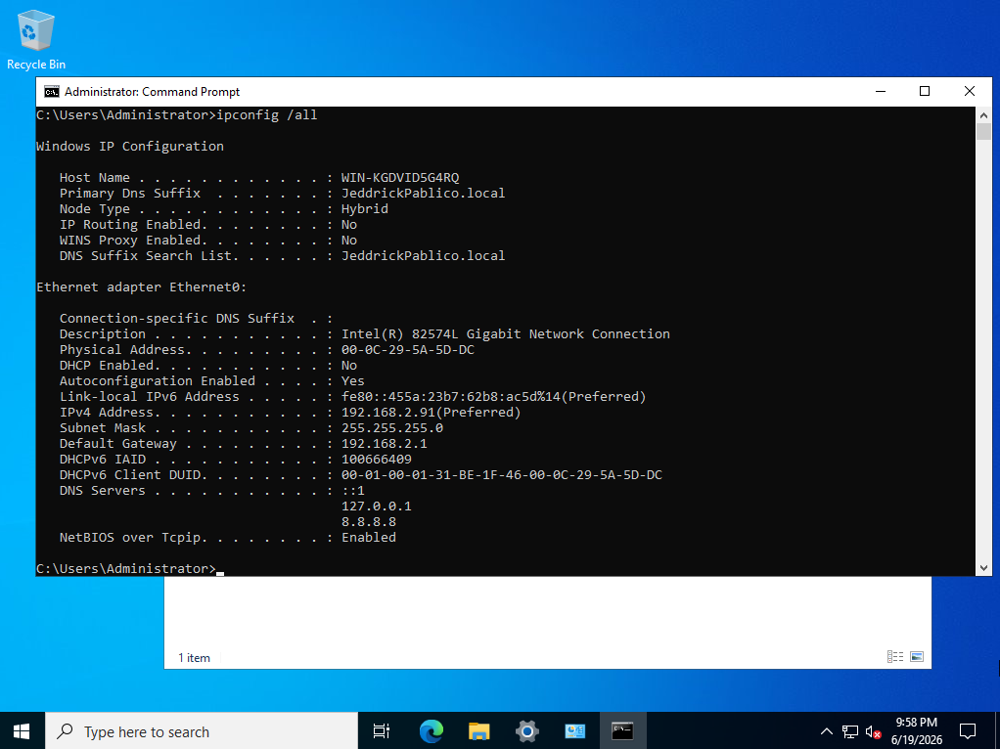

<i>Figure 5.1.7: Verifying the new static IP and DNS configuration.</i>

---

### 5.2 Configuring the Client Virtual Machine for Domain Join

To test the domain, you must install a fresh instance of a compatible Windows OS (like Windows 10 or 11 Pro) on a separate virtual machine. The following steps take place during the initial Out-Of-Box Experience (OOBE) setup of that client machine.

**5.2.1** During the initial Windows setup, you will be prompted to sign in with a Microsoft account. To bypass this and prepare the machine for our network, select the offline option, typically labeled **Domain join instead** or **Join a local Active Directory domain** (depending on your specific Windows build).

  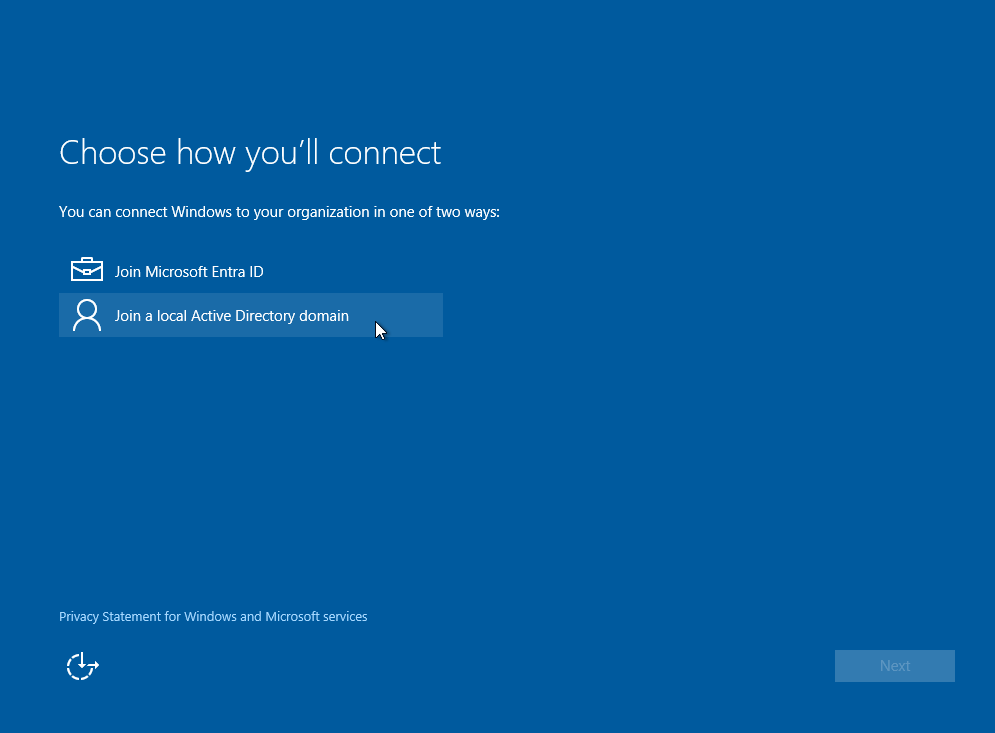

<i>Figure 5.2.1: Bypassing the Microsoft account requirement to prepare for a domain join.</i>

**5.2.2** The setup wizard will now ask you to create a user. Create a standard local administrative account (e.g., `LocalAdmin`) and assign it a password. 

*Note: You must complete this local setup to reach the Windows desktop. This local account acts as a fallback administrator. Once we successfully connect this machine to the server, we will log out of this local account and log back in using the Active Directory user credentials we created in Phase 4.*

  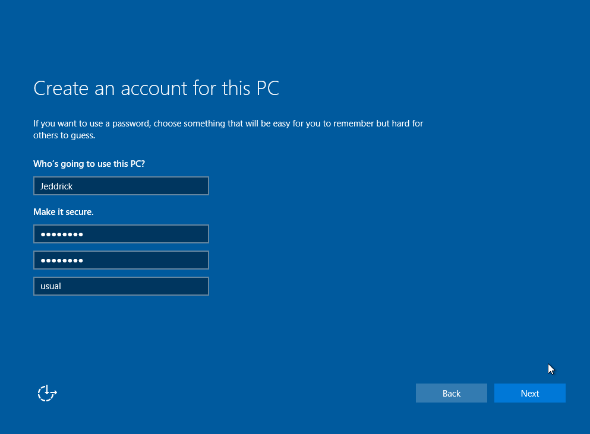

<i>Figure 5.2.2: Establishing a temporary local account to complete the OS installation.</i>

**5.2.3** Once you reach the Windows desktop, open your Network & Internet Settings, navigate to **Change adapter options**, and right-click your network adapter to select **Properties**.

  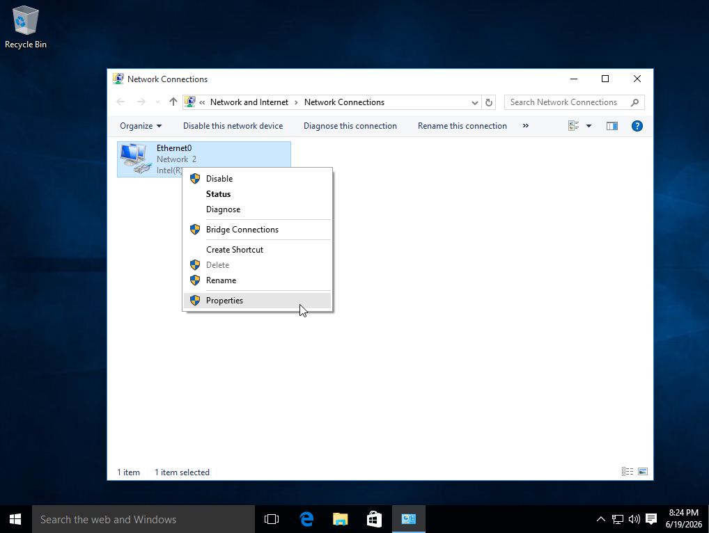

<i>Figure 5.2.3: Opening the client network adapter properties.</i>

**5.2.4** Select **Internet Protocol Version 4 (TCP/IPv4)** from the list and click **Properties**.

  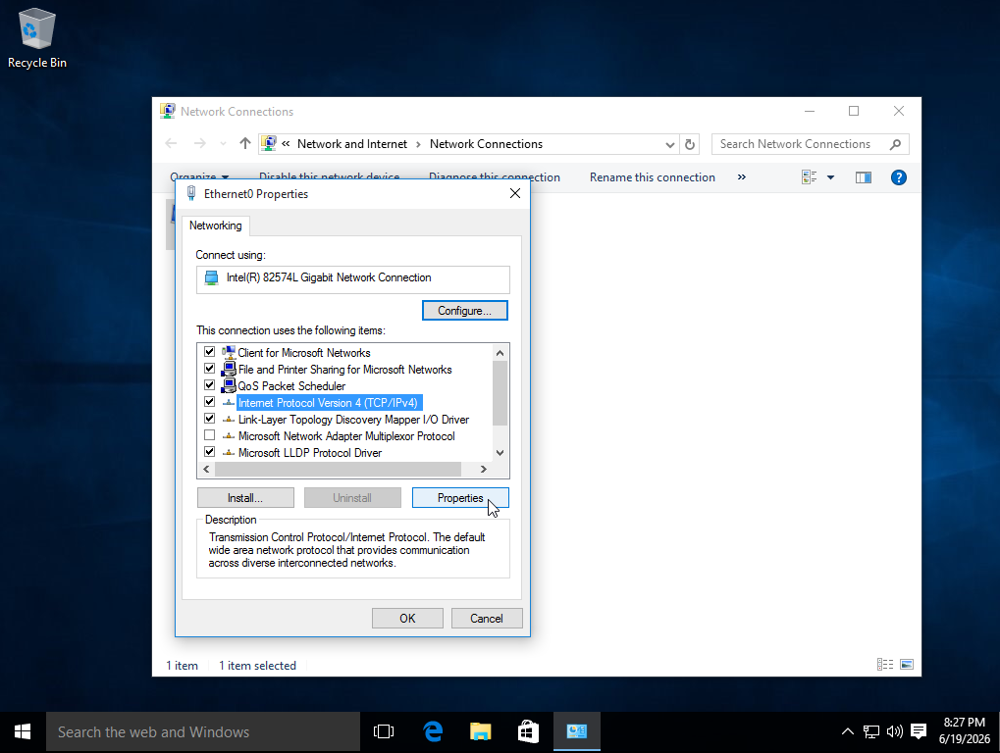

<i>Figure 5.2.4: Accessing the IPv4 configuration on the client.</i>

**5.2.5** In this menu, leave the top option set to **"Obtain an IP address automatically"**. It is perfectly fine for client computers to have dynamic IPs. 

However, you must select **"Use the following DNS server addresses"**. Active Directory relies entirely on DNS to locate the Domain Controller. If the client doesn't know the exact IP address of the server, it cannot resolve the `JeddrickPablico.local` domain name to authenticate. *(This is precisely why we made the server's IP static in Phase 5.1; if the server's IP changed upon reboot, the client's DNS pointer would break, severing the domain connection).*

*   **Preferred DNS server:** `192.168.2.91` *(The static IPv4 address of your Windows Server)*
*   **Alternate DNS server:** `8.8.8.8` *(Google's public DNS for internet fallback)*

Click **OK** to apply the settings.

  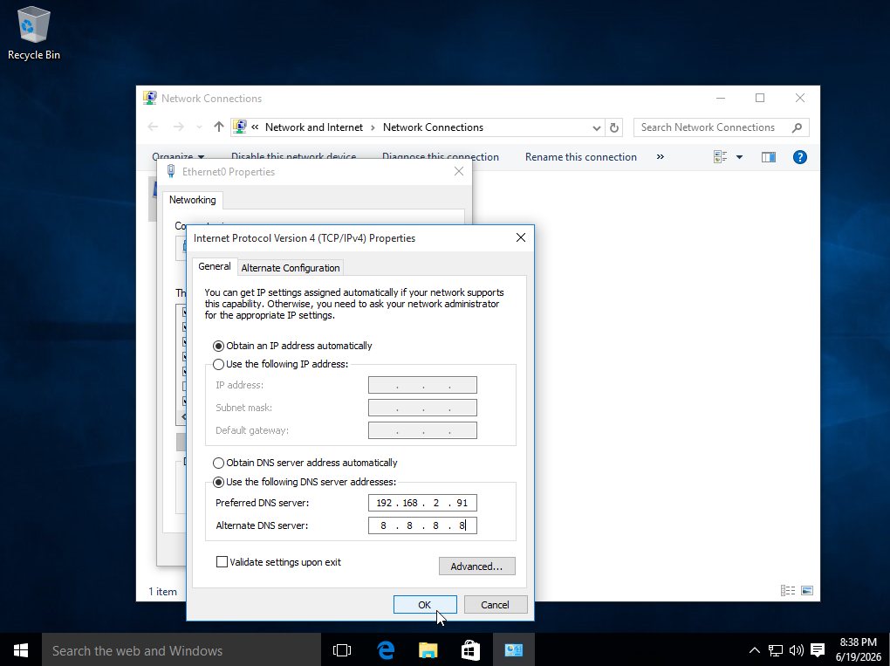

<i>Figure 5.2.5: Pointing the client's DNS queries to the Domain Controller.</i>

**5.2.6** Before attempting to join the domain, we must verify network connectivity. Open the **Command Prompt** and type `ping 192.168.2.91` (replace with your server's IP). You should receive successful replies indicating the two machines can communicate. 

  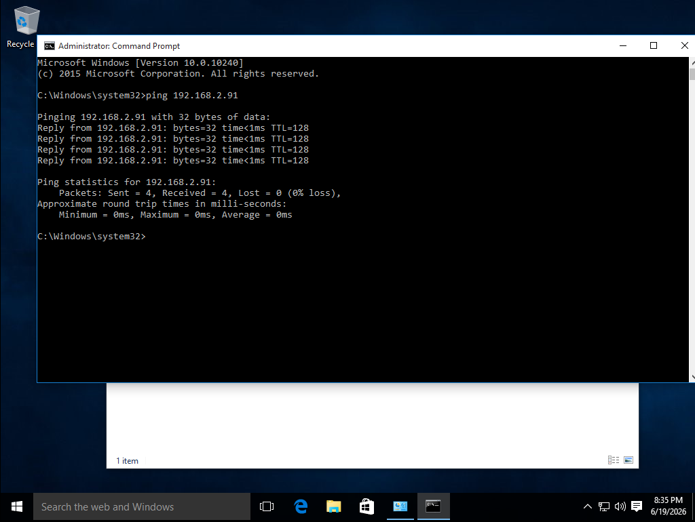

<i>Figure 5.2.6: Verifying basic network connectivity via ping.</i>

> ⚠️ **Enterprise Context: Real-World Practices vs. Homelab Configuration**
> 
> **1. Manual DNS vs. DHCP Scope Options**
> * **The Risk:** In step 5.2.5, we manually typed the DNS server into the client computer. In a real corporate environment with hundreds of computers, doing this manually is impossible to maintain. 
> * **The Enterprise Solution:** IT administrators configure a **DHCP Server** role. Inside the DHCP settings, they configure "Scope Options" (specifically Option 006). When a client plugs into the network, the DHCP server automatically hands it an IP address *and* automatically programs the preferred DNS server to point to the Domain Controller. 
>
> **2. The Client Alternate DNS Risk**
> * **The Risk:** Setting `8.8.8.8` as the alternate DNS on a domain-joined client is a massive security and operational risk. If the Domain Controller takes a moment too long to respond, Windows may instantly failover the query to Google. Google cannot resolve internal network names, resulting in random "Domain Not Found" errors or mapped network drives suddenly disconnecting.
> * **The Enterprise Solution:** Domain-joined clients should **only** have internal Domain Controllers listed in their DNS settings. The Domain Controller itself handles reaching out to the internet (via DNS Forwarders) on behalf of the client.
>

---

### 5.3 Joining the Client to the Domain

With the network adapter actively pointing to the Domain Controller for DNS resolution, the client machine is now ready to securely authenticate and bind to the Active Directory environment.

**5.3.1** On the client machine, open the Windows Start menu and search for **"Rename this computer"**, then click the corresponding system settings option. Under the device specifications, look for the option to rename the PC (advanced) or click **Domain or workgroup** to open the classic System Properties dialog box.

  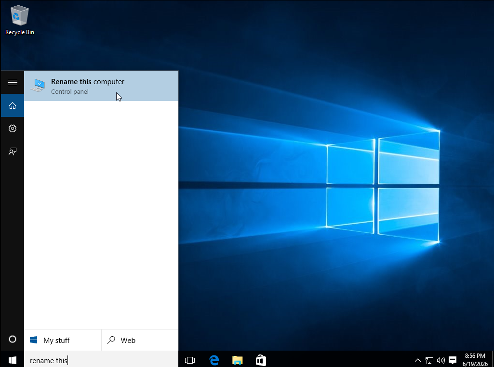

<i>Figure 5.3.1: Accessing the advanced System Properties.</i>

**5.3.2** In the System Properties window, click the **Change...** button. First, give the client computer a professional, identifiable Computer name (e.g., `CLIENT-PC01`). Next, under the "Member of" section, click the **Domain** radio button and type the Fully Qualified Domain Name (FQDN) of your server (e.g., `JeddrickPablico.local`). Click **OK**.

  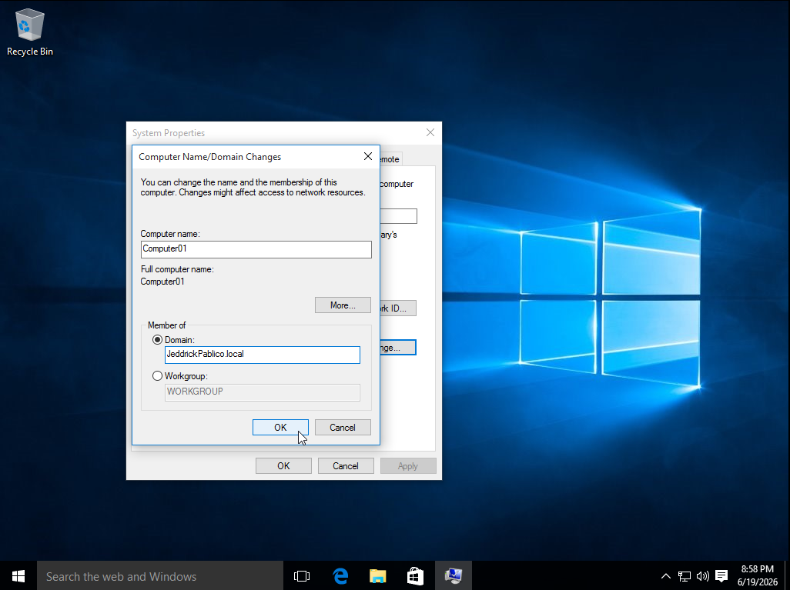

<i>Figure 5.3.2: Changing the computer name and initiating the domain bind.</i>

**5.3.3** If your DNS was configured correctly in Phase 5.2, a Windows Security credential prompt will appear. This means the client successfully resolved the domain name and is contacting the Domain Controller. Enter the credentials of your Active Directory **Administrator** account to authorize the machine to join the network. Click **OK**.

  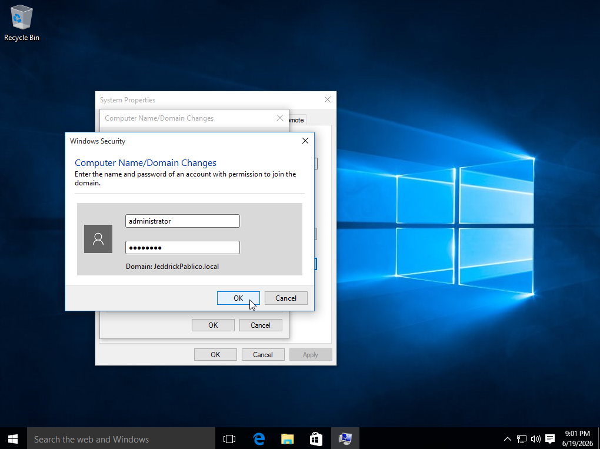

<i>Figure 5.3.3: Authorizing the domain join with administrator credentials.</i>

**5.3.4** A welcome dialog box stating *"Welcome to the JeddrickPablico.local domain"* will appear. Click **OK**. You will then be prompted to restart the computer to apply the domain membership changes. Proceed with the reboot.

  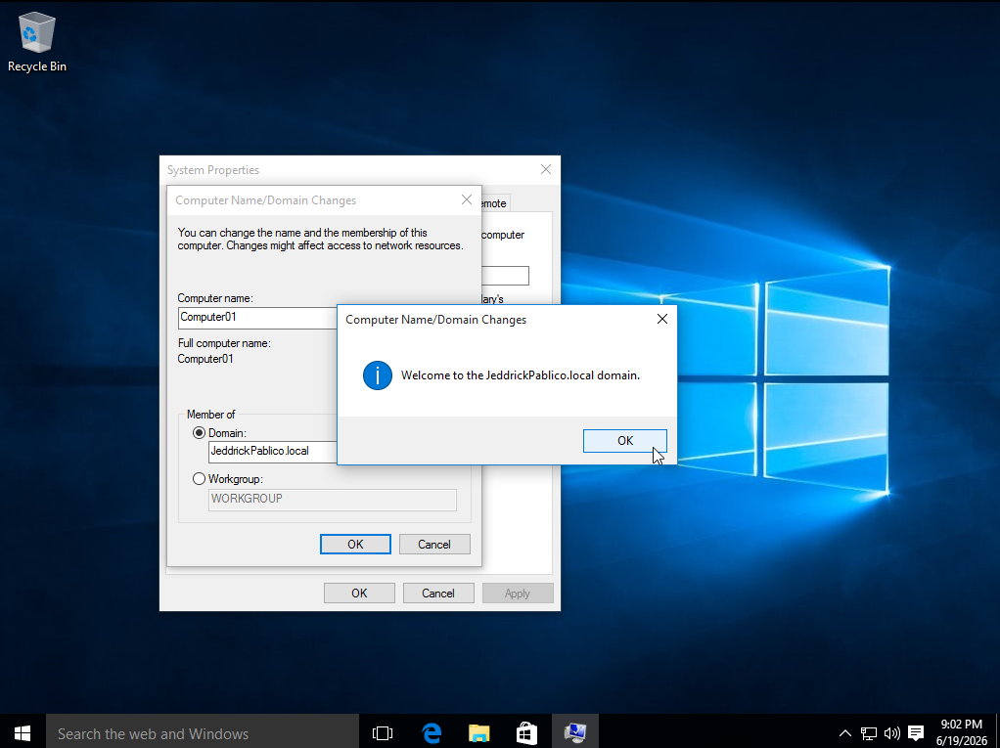

<i>Figure 5.3.4: Successfully joined the domain.</i>

**5.3.5** Once the computer reboots, you will be presented with the Windows lock screen. Instead of logging into the local admin account, select **Other user** in the bottom left corner. Enter the credentials of the standard Active Directory user you created in Phase 4 (e.g., `john.doe`). Notice that the "Sign in to:" indicator below the password box now displays your NetBIOS domain name.

  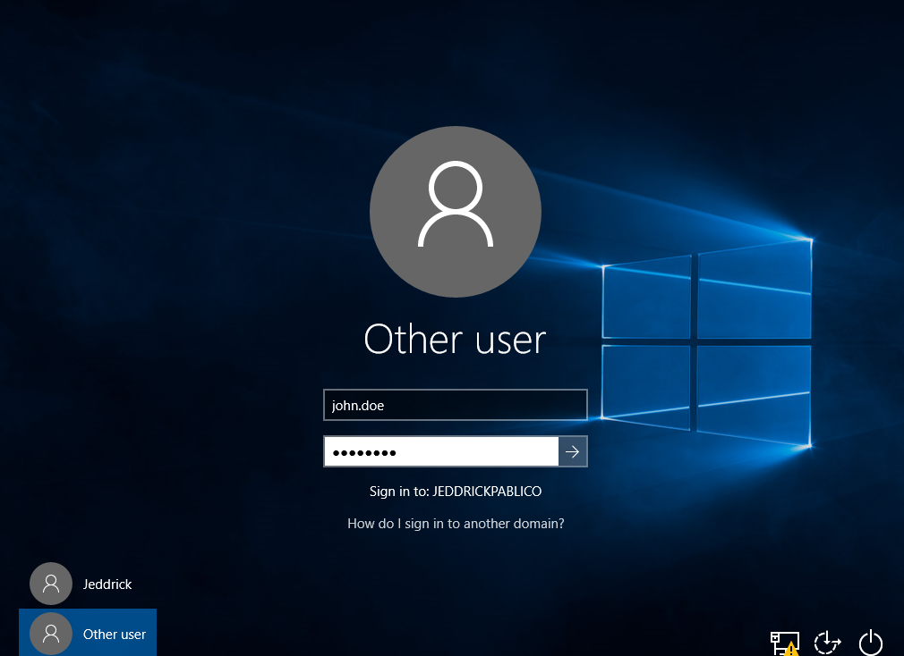

<i>Figure 5.3.5: Authenticating against the Domain Controller for the first time.</i>

**5.3.6** Because we checked the *"User must change password at next logon"* box during account creation, Windows will immediately prompt you with a message indicating the password must be changed. Click **OK**.

  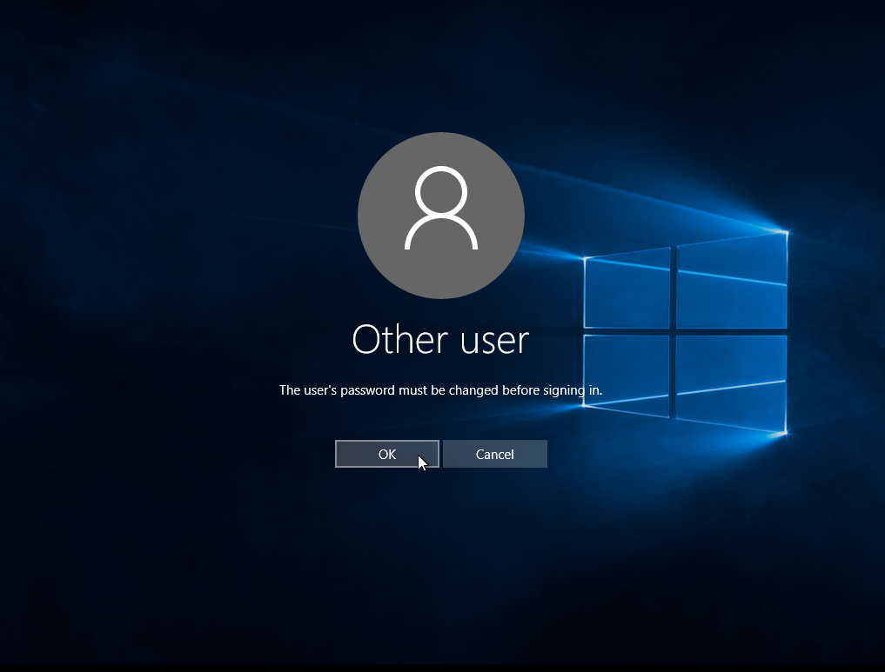

<i>Figure 5.3.6: Triggering the initial password policy.</i>

**5.3.7** Type in a new, secure password for the user, confirm it, and press **ENTER**. The system will update the user's object inside Active Directory and log you into the Windows desktop.

  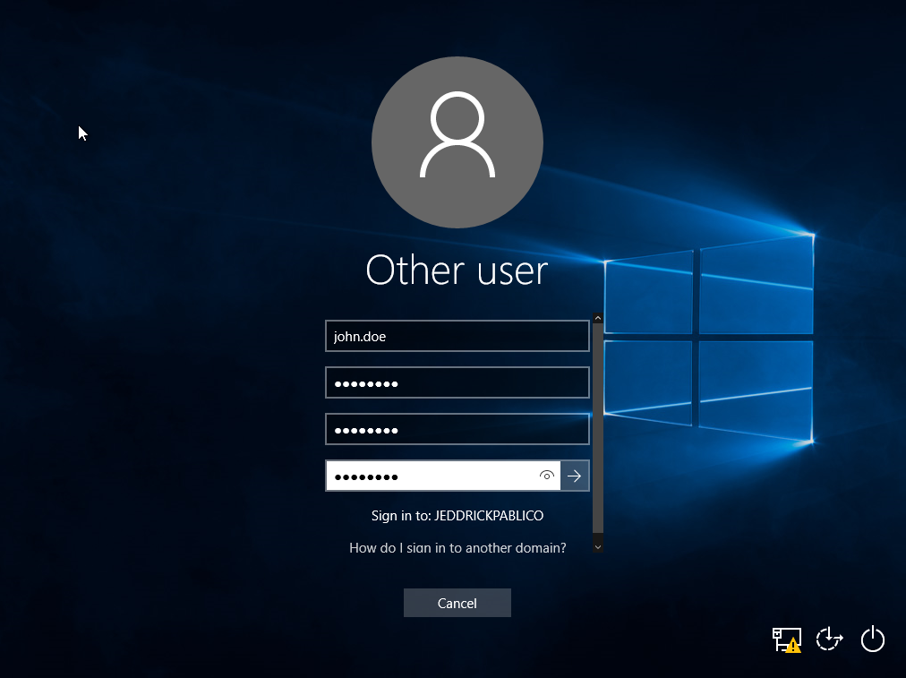

<i>Figure 5.3.7: Establishing the user's permanent password.</i>

**5.3.8** To definitively verify your domain identity, open the **Command Prompt** and type `whoami`. The output should display your NetBIOS domain name followed by the username (e.g., `jeddrickpablico\john.doe`). 

Congratulations! You have successfully installed a Windows Server, architected an Active Directory environment, provisioned secure user accounts, and bound a client workstation to the domain.

  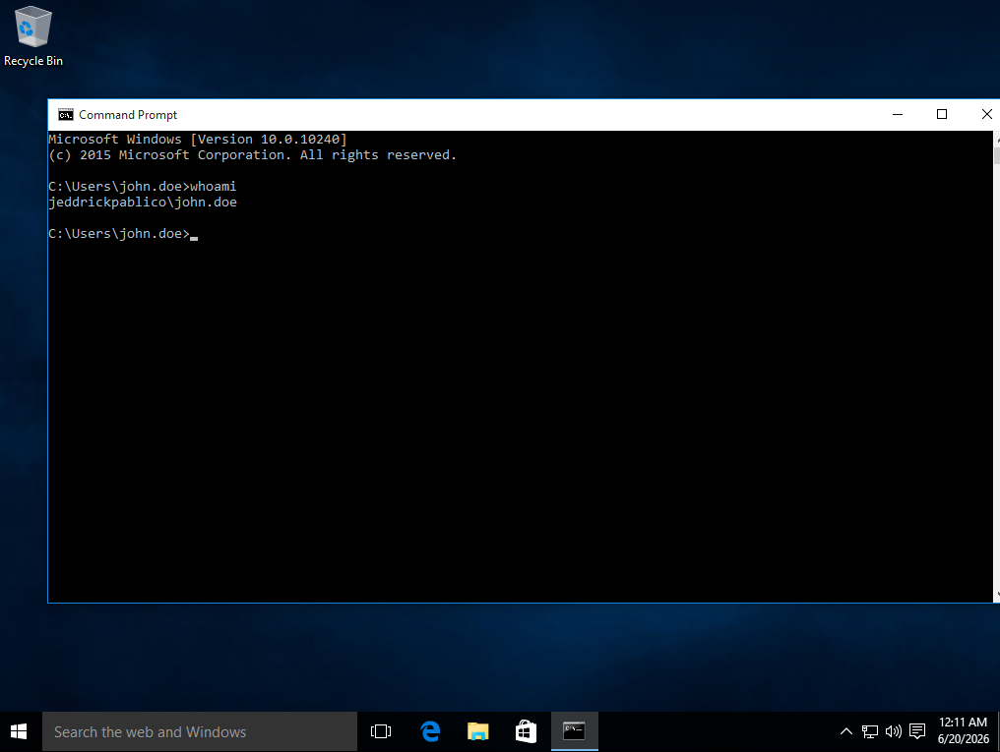

<i>Figure 5.3.8: Verifying the active session identity via Command Prompt.</i>

> ⚠️ **Enterprise Context: Real-World Practices vs. Homelab Configuration**
> 
> **1. Managing the Computer Object**
> * **The Process:** When you bind a computer to the domain in step 5.3.4, Active Directory automatically generates a "Computer Object" for it. 
> * **The Enterprise Practice:** By default, AD drops all newly joined computers into a generic container called `CN=Computers`. Group Policies (GPOs) cannot be applied to default containers. Therefore, standard operating procedure dictates that immediately after a computer joins the domain, the IT administrator must open ADUC and physically move that new computer object from `CN=Computers` into the appropriately nested Organizational Unit (e.g., `OU=USA -> OU=Computers`) that we built in Phase 3.
>
> **2. Domain Join Permissions**
> * **The Risk:** Out of the box, Active Directory allows *any* authenticated user to join up to 10 computers to the domain. In a real-world scenario, this is a massive security vulnerability, as an employee could plug a personal, malware-infected laptop into the wall and bind it to the corporate network.
> * **The Enterprise Solution:** Administrators modify the Default Domain Policy to restrict the "Add workstations to domain" user right specifically to the "Domain Admins" or designated "IT Provisioning" security groups.

---

## ⏭️ What's Next?

In the next tutorial, we will be diving into **Group Policy Management**. 

Now that we have established our organizational structure, provisioned users, and successfully joined a client machine to the domain, Group Policy is where the true power of Active Directory comes to life. 

Understanding Group Policy is critical for any IT professional because it enables **centralized configuration management and automated security enforcement**. Instead of an administrator manually clicking through settings on hundreds of individual workstations, Group Policy Objects (GPOs) allow you to change wallpaper backgrounds, map departmental network drives, push software installations, enforce strict password complexities, and lock down security vulnerabilities (like disabling USB ports) across an entire global enterprise—all from a single management console. It is the definitive tool for keeping an enterprise environment secure, uniform, and scalable.
