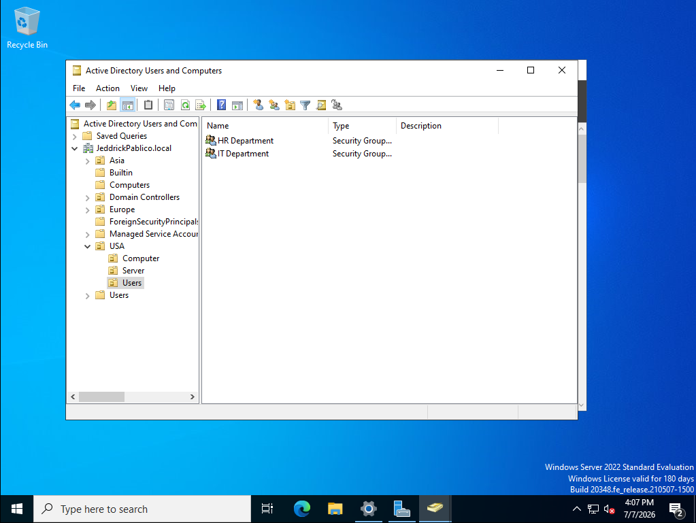
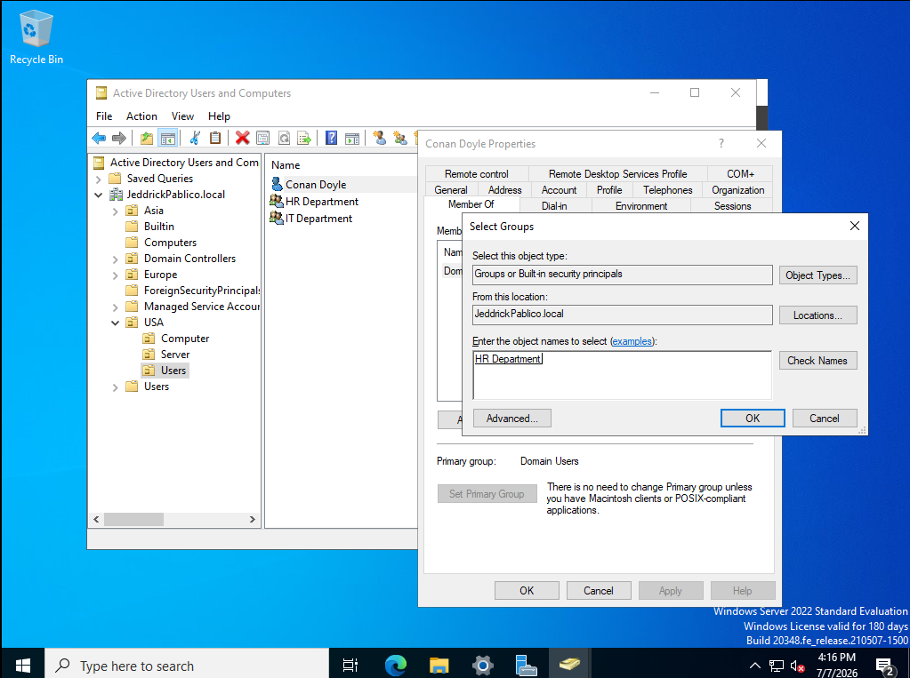
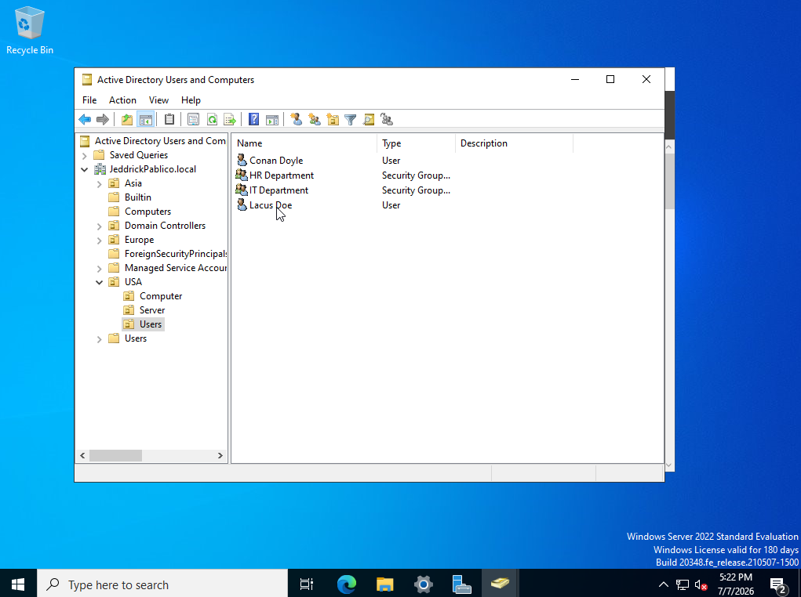

# 📁 Windows File Services & Permission Management Project

## 🎯 Objectives
The primary objective of this project is to provision, secure, and manage centralized network storage using **Windows File Services**, strict **NTFS/Share Permissions**, and **File Server Resource Manager (FSRM)**.

This activity covers the following deployment milestones based on our network setup:
* Understanding the architectural differences between NTFS and Shared permissions, inheritance, and network access methods.
* Establishing foundational network shares and deploying them to client machines.
* Installing and configuring FSRM to implement storage Quotas and File Screening to restrict unauthorized media.
* Understanding and applying the critical architectural differences between NTFS and Shared permissions.
* Managing advanced permission inheritance to secure confidential departmental data.
* Enabling Access-Based Enumeration (ABE) to securely hide restricted resources from unauthorized users.

---

## ⚙️ Prerequisites & Server Preparation
Ensure your Windows Server environment is running and promoted to a Domain Controller. You must have client endpoints connected to the domain and pre-configured user accounts belonging to specific departmental Security Groups and knowledge on GPOs. Refer to my previous tutorial on [Basic Active Directory Setup Activity](https://github.com/jeddrickpablico/ActiveDirectoryProjects/blob/main/DomainControllerInstallationAndSetup.md) and [Group Policy Management & Security Hardening Activity](https://github.com/jeddrickpablico/ActiveDirectoryProjects/blob/main/GPOProject.md)

---

## 📖 Phase 1: Core Concepts of File & Folder Sharing

In a Windows Server environment utilizing Active Directory (AD), file and folder sharing is the foundation of collaborative enterprise storage. Rather than storing files on isolated individual computers, organizations host data on centralized file servers. By leveraging Active Directory, administrators can use security groups (e.g., "HR-Department" or "IT-Admins") to efficiently manage who can view, modify, or delete specific data. This ensures that sensitive information remains secure while allowing employees seamless access to the resources they need to perform their jobs.

### 1.1 Permissions and Access Control
Permissions dictate exactly what a user or group can do with a file or folder once they have access to it. The standard permission levels include:
*   **Read:** Allows users to view files and folder contents.
*   **Write:** Allows users to create new files and modify existing content.
*   **Execute:** Allows users to run application files (like `.exe` or scripts).
*   **Full Control:** Grants complete power over the file or folder, including the ability to change permissions and take ownership.

These permissions are evaluated differently depending on how the user is accessing the data—either Locally (logged directly into the server hosting the files) or over the Network (accessing from a remote workstation).

### 1.2 Types of Permissions: NTFS vs. Share Permissions
When sharing a folder across a network, administrators must configure two distinct sets of permissions. Understanding the difference between these two is critical for securing a file server:

**NTFS Permissions**
These are the foundational security settings of the file system itself.
*   **Where it applies:** Applies to both local users (on the file system) and network users.
*   **Configuration:** Managed in the **Security tab** of a folder's properties.
*   **Scope:** Can be applied to the parent folder, individual subfolders, and even specific files.
*   **Granular Control:** Very detailed (Full Control, Modify, Read & Execute, etc.).

**Share Permissions**
These act as the "front door" to the folder when accessed over the network.
*   **Where it applies:** *Only* applies to users accessing the folder remotely via the network. If a user logs into the server locally, share permissions are bypassed entirely.
*   **Configuration:** Managed in the **Sharing tab** of a folder's properties.
*   **Scope:** Applies only to the shared folder level (no subfolder control).
*   **Granular Control:** Very basic (Full Control, Change, Read).

> 🛑 **The Key Rule of Permissions: NTFS + Share**
>
> When a user accesses a file over the network, both Share and NTFS permissions are evaluated together. The golden rule is that **NTFS and Share permissions combine, and the most restrictive applies.**
> 
> *Example:* If a user has "Full Control" via Share Permissions, but only "Read" via NTFS permissions, their effective access will be limited strictly to "Read".
>
> **Because of this rule, the modern enterprise best practice is to grant "Everyone - Full Control" on the Share tab, and then lock down all actual security and access control granularly using the NTFS Security tab.**
> 

### 1.3 Permission Inheritance
By default, permissions flow downwards. A child object (a subfolder) automatically **inherits** the permissions set on the parent folder by default.

*   **Explicit vs. Inherited:** **Explicit permissions** are those assigned directly to a specific file or folder. Explicit permissions always take priority over inherited ones.
*   **Disabling Inheritance:** If a specific subfolder (like an "Executive Payroll" folder inside an "HR" drive) needs completely different, stricter access levels than its parent, administrators can disable inheritance to break the chain and apply distinct explicit permissions.
*   **Enterprise Scaling and ABE:** Relying heavily on breaking inheritance and setting explicit permissions everywhere can become an administrative nightmare in large companies. Instead of relying purely on complex explicit permissions to hide data, large environments utilize Access-Based Enumeration (ABE). ABE dynamically hides folders from a user's view if they do not have the NTFS permissions to read them, ensuring a clean and secure network environment without overly complicating the folder permission structure.

### 1.4 Sharing Methods
Once a folder is shared and secured, users can access it via two primary methods using a **UNC (Universal Naming Convention)** path:
1.  **Network (Direct Access):** Users access the shared folder directly via a network path.
2.  **Mapped Drive:** For easier, everyday access, a shared network folder can be "mapped" to a specific drive letter on the user's computer (e.g., making the company share appear as the Z: drive alongside their local C: drive).

Regardless of the method used, both rely on a UNC (Universal Naming Convention) path to locate the resource, formatted as `\\ServerName\SharedFolderName`.

---

## 🛠️ Phase 2: Establishing Active Directory Groups & Department Shares

In this phase, we are establishing the foundation for a secure, compartmentalized file system. The core objective is to enforce the **Principle of Least Privilege**. We are setting up our environment so that an employee belonging to a specific department (such as HR) can only access the files and folders explicitly designated for their department. They will remain completely isolated and blocked from viewing or modifying the private data of other departments (such as IT). 

Before configuring these permissions, we must create our target Security Groups in Active Directory, populate them with test users, and build the physical folder structure on the server.

**2.1** Open **Active Directory Users and Computers (ADUC)**. Navigate to your target OU (e.g., `Users`). Right-click and select **New > Group**. Create two Global Security groups: `HR Department` and `IT Department`.

  

<i>Figure 2.1: Provisioning the departmental security groups in Active Directory.</i>

**2.2** Navigate to your target OU (e.g., `Users`). Right-click and select **New > User** to create two test accounts. Create a user `Conan Doyle` and add him to the `HR Department` group. To do this, right-click on Conan Doyle > Properties > Member Of (tab) > Add > Type in  HR Department > Check Names > OK

  

<i>Figure 2.2: </i>

**2.2** Create another user named 'Lacus Doe' and add him to the IT Department. Do the same steps as 2.2, but this time, type in IT Department.

  

<i>Figure 2.2:</i>

**2.3** On your Windows Server, open File Explorer and navigate to the local `C:` drive. Create a new root folder named `Department Shares`.

  

<i>Figure 2.3: Establishing the main network directory.</i>

**2.4** Inside `Department Shares`, create two subfolders named `HR` and `IT`.

  

<i>Figure 2.4: Building the subfolder structure.</i>

---

## 🛠️ Phase 3: Architecting Baseline Share Permissions

We must now expose the `Department Shares` folder to the network. This is where we configure the "front door" network access.

**3.1** Right-click the root `Department Shares` folder, select **Properties**, and navigate to the **Sharing** tab. Click **Advanced Sharing**, check the box for **Share this folder**, and click **Permissions**.

  

<i>Figure 3.1: Configuring the front-door network access.</i>

**3.2** By default, the `Everyone` group is granted **Read** access. Select the `Everyone` group and check the box to grant **Full Control**. Click **Apply** and **OK**.

  

<i>Figure 3.2: Setting the baseline share permission.</i>

> ⚠️ **Enterprise Best Practice: The "Full Control" Share Permission Strategy**
> You might wonder why we just granted "Full Control" at the Share level. It seems highly insecure to leave the network "front door" wide open. However, this is the modern enterprise standard, and it all comes back to the golden rule: **Share permissions and NTFS permissions combine, and the most restrictive applies.**
> 
> Share permissions are very basic (only Read, Change, and Full Control) and they cannot be applied to subfolders. NTFS permissions are incredibly granular and apply to every file and subfolder. By leaving the Share permissions wide open, network engineers ensure they never accidentally lock themselves out or create conflicting permission overlaps. They can confidently centrally manage all the real security and granular access control exclusively through the NTFS Security tab, knowing that NTFS will strictly overrule the wide-open Share permission.

---

## 🛠️ Phase 4: Managing NTFS Inheritance for Restricted Data

Because we left the Share permissions wide open in Phase 3, we must now lock down the actual file system using NTFS. We need to isolate the `HR` and `IT` subfolders from each other by breaking the NTFS permission chain.

### 4.1 Securing the HR Folder
**4.1.1** Right-click the `HR` subfolder, select **Properties**, go to the **Security** tab, and click **Advanced**.
**4.1.2** Click **Disable inheritance**. When prompted, select **Convert inherited permissions into explicit permissions on this object**.

  

<i>Figure 4.1.2: Breaking the permission chain from the parent directory.</i>

**4.1.3** In the permission entries list, locate the generic `Users` (or `Everyone`/`Authenticated Users`) group and click **Remove**. This strictly enforces our NTFS security by ensuring standard non-HR members lose access.
**4.1.4** Click **Add**, click **Select a principal**, type `HR Department`, and click **OK**. Check the box for **Modify** or **Full Control** and click **OK** to apply. The HR folder is now completely isolated.

  

<i>Figure 4.1.4: Assigning explicit permissions exclusively to the HR department.</i>

### 4.2 Securing the IT Folder
**4.2.1** Repeat the exact same granular lockdown process for the `IT` subfolder: Right-click > **Properties** > **Security** > **Advanced** > **Disable Inheritance** > **Convert**.
**4.2.2** Remove the generic `Users` group.
**4.2.3** Click **Add**, select the `IT Department` group, and assign them **Modify** or **Full Control**. Click **Apply** and **OK**.

---

## 💻 Phase 5: Access-Based Enumeration (ABE) Deployment

At this stage, our data is technically secure at the NTFS level. If an HR user logs in and opens `Department Shares`, they can access the `HR` folder. If they try to open the `IT` folder, they will be blocked by an "Access Denied" error. 

However, leaving inaccessible folders visible to everyone creates a messy user experience. Seeing restricted folders causes UI clutter, prompts user confusion, and often generates unnecessary helpdesk tickets (e.g., "Why is my access denied when I click on this folder?"). 

**Access-Based Enumeration (ABE)** clears this up entirely. ABE dynamically filters the user interface based on NTFS permissions. If a user does not have permission to read a folder, ABE makes that folder completely invisible to them, providing a clean, personalized, and highly secure File Explorer experience.

**5.1** Open **Server Manager**, and navigate to **File and Storage Services > Shares** on the left-hand navigation pane.

  

<i>Figure 5.1: Locating the active network shares in Server Manager.</i>

**5.2** Right-click your active `Department Shares` share and select **Properties**.

  

<i>Figure 5.2: Accessing the specific share settings.</i>

**5.3** Go to the **Settings** tab. Check the box for **Enable access-based enumeration**. Click **Apply** and **OK**.

  

<i>Figure 5.3: Toggling the ABE feature on the share.</i>

**5.4** To validate the deployment, switch to your Windows 11 client machine. Log in as your HR user (`Conan Doyle`).
**5.5** Open File Explorer and navigate to the UNC path of your server (e.g., `\\Server01\Department Shares`).
**5.6** You will notice that the `HR` folder is fully visible, but the `IT` folder is completely invisible, successfully demonstrating ABE clearing up the interface based on user access.

  

<i>Figure 5.6: Validation that restricted folders are successfully hidden from the user interface.</i>

---

## 🛡️ Phase 6: File Server Resource Manager (FSRM) Protection

Now that our permissions and visibility are perfectly tuned, we must protect the server's storage capacity and prevent malicious or unapproved files from being dumped into the `Department Shares`.

**6.1** Open **Server Manager**, navigate to **Manage > Add Roles and Features**, and install the **File Server Resource Manager (FSRM)** under the File and Storage Services node.

  

<i>Figure 6.1: Deploying the FSRM toolset for advanced storage control.</i>

**6.2** Launch FSRM from the Administrative Tools. Navigate to **Quota Management > Quotas**.
**6.3** Right-click and select **Create Quota**. Browse to your `C:\Department Shares` path. Apply a strict storage limit (e.g., a 10GB hard quota). This prevents either department from consuming all available server disk space.

  

<i>Figure 6.3: Enforcing a hard quota limit on the network share.</i>

**6.4** Navigate to **File Screening Management > File Screens**. 
**6.5** Right-click and select **Create File Screen**. Browse to the `C:\Department Shares` path. Select templates to block **Audio and Video Files** and **Executable Files** from being saved to the server.

  

<i>Figure 6.5: Applying file screens to reject unauthorized file types.</i>

> 🧠 **Enterprise Context: Combating Shadow IT**
> Without FSRM, users often treat expensive, highly-available SAN (Storage Area Network) space as their personal hard drive, backing up personal iPhones or downloading massive `.mp4` files. File Screening enforces acceptable use policies at the system level. Additionally, blocking `.exe` and script files on standard user shares is a critical defense-in-depth strategy against ransomware dropping executable payloads into accessible network drives.
