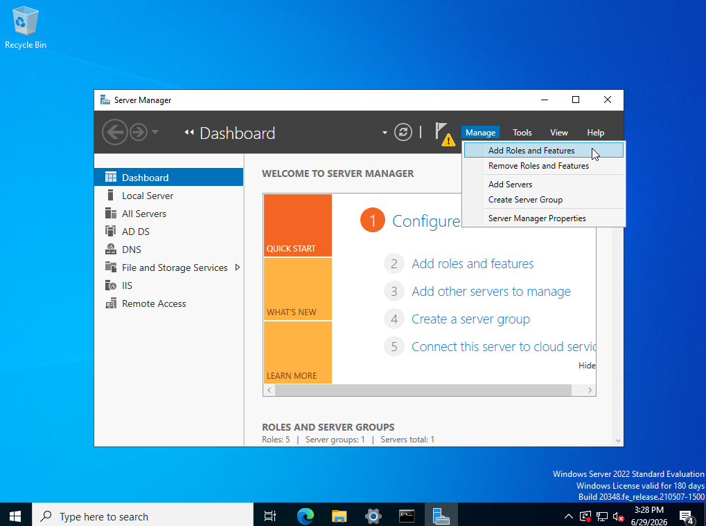
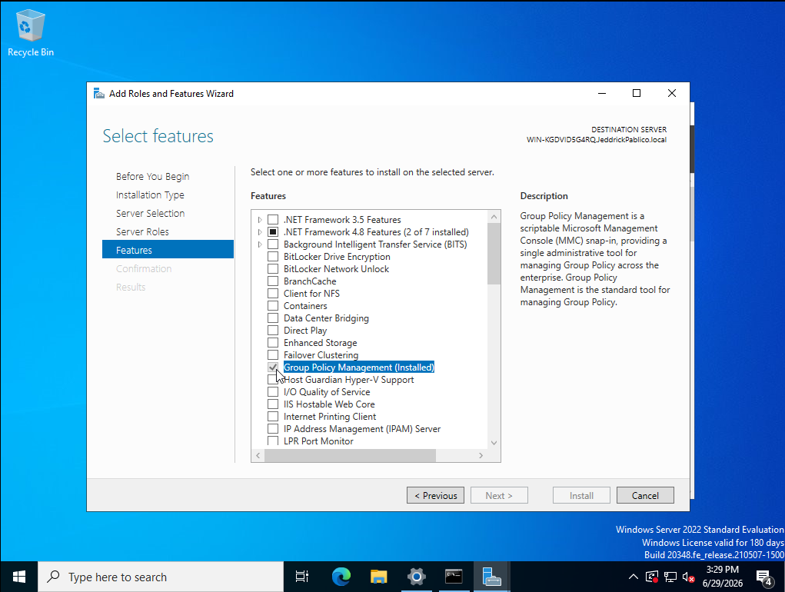
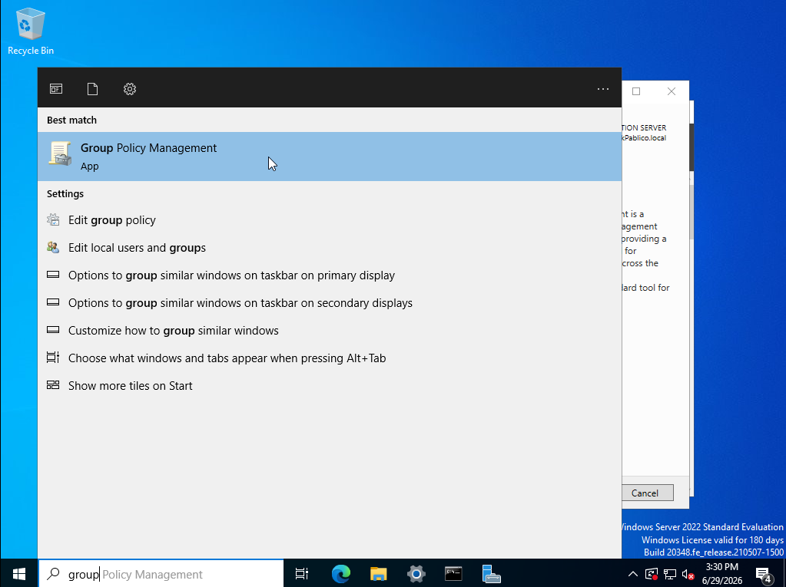
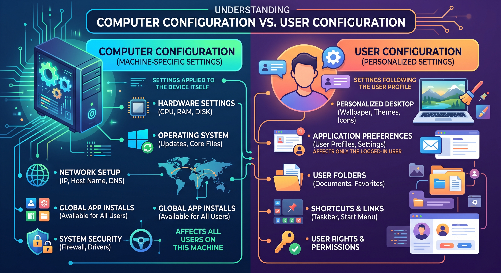
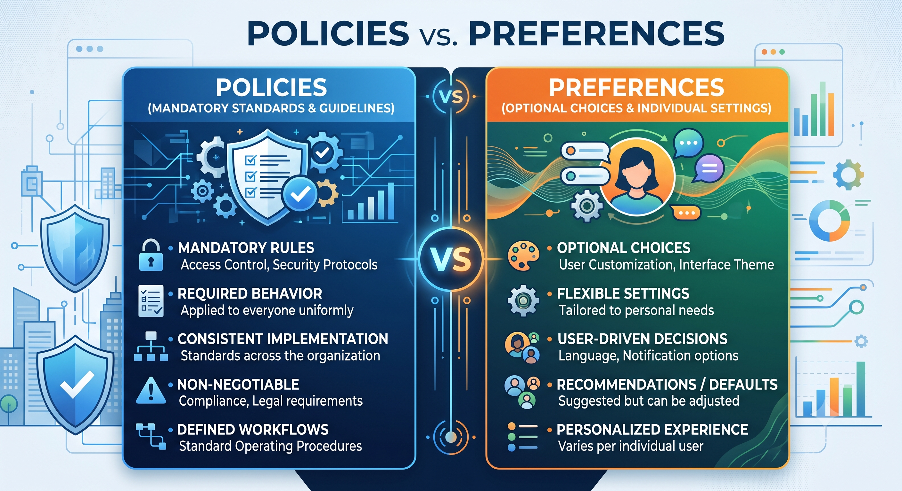

# 🛡️ Group Policy Management & Security Hardening Activity

## 🎯 Objectives
The primary objective of this project is to architect, configure, and secure the Active Directory environment using **Group Policy Objects (GPOs)**.

This activity covers the following deployment milestones based on our network setup:
* Installing and navigating the Group Policy Management Console (GPMC).
* Understanding the critical architectural differences between Computer vs. User configurations, and Policies vs. Preferences.
* Creating foundational GPOs (Password Policies, Drive Mapping, Desktop Wallpapers, Control Panel Restrictions, and USB Storage blocks).
* Moving computer objects within Active Directory Users and Computers (ADUC) and linking GPOs to target Organizational Units (OUs).
* Forcing policy updates on the client machine to test and verify domain restrictions.

---

## ⚙️ Prerequisites & Server Preparation
Ensure your Windows Server environment is running and the Active Directory Domain Services (AD DS) role is installed and promoted to a Domain Controller.

---

## 🛠️ Phase 1: Installing and Navigating Group Policy Management Console (GPMC)

The GPMC is the central tool used by administrators to manage all Group Policy settings and apply them to domain assets.

**1.1** If you have not already installed the GPMC, open **Server Manager**, navigate to **Manage > Add Roles and Features**.

  

<i>Figure 1.1: Verifying the installation of the GPMC feature.</i>

**1.2** Select all the default settings. Proceed to the **Features** tab. Ensure **Group Policy Management** is checked and complete the installation.

  

<i>Figure 1.2: Selecting the required GPMC tools for installation.</i>

**1.3** To launch the console, open the Start Menu, type **Group Policy Management**, and open the application. Alternatively, you can find it under **Windows Administrative Tools**.

  

<i>Figure 1.3: Launching the GPMC.</i>

**1.4** In the left navigation pane, expand your **Forest**, then expand **Domains**, and click on your root domain (e.g., `JeddrickPablico.local`). You will see your directory structure, including your OUs (e.g., USA, Europe, Asia which was made in the previous [tutorial](https://github.com/jeddrickpablico/ActiveDirectoryProjects/blob/main/DomainControllerInstallationAndSetup.md)) and a folder named **Group Policy Objects**. 

> 🧠 **Enterprise Context: GPO Hierarchy & Types**
> Before creating policies, you must understand where and how settings are applied:
> 
> **Configurations:**
> * **Computer Configuration:** Applies settings directly to the local computer, regardless of which user logs into it.
> * **User Configuration:** Applies settings to the user account, following that user to any machine they log into within the domain.
> 

> 
<i>Figure 1.4.1: Computer Configuration vs. User Configuration.</i>

> 
> **Settings Types:**
> * **Policies:** Strictly enforced by Active Directory. Users *cannot* change these settings (e.g., Account lockout thresholds).
> * **Preferences:** Set default baselines that users *are* allowed to modify later (e.g., Adding their own shortcuts alongside a default mapped network drive).
> 

> 
<i>Figure 1.4.2: Policies vs. Preferences.</i>

---

## 🛠️ Phase 2: Creating Foundational Group Policy Objects

It is best practice to create GPOs in the central **Group Policy Objects** container first and configure them before linking them to specific OUs.

### 2.1 Password Policy (Computer Configuration -> Policy)

*This policy enforces fundamental account security by dictating how complex a password must be, its minimum length, and how frequently it must be changed to mitigate credential compromise.*

**2.1.1** Right-click the **Group Policy Objects** folder (or directly on your domain) and select **New** or **Create a GPO in this domain, and Link it here...**. Name it `Password Policy` and click **OK**.

  

<i>Figure 2.1.1: Establishing a new GPO for password security.</i>

**2.1.2** Right-click the newly created `Password Policy` GPO and select **Edit**. Navigate to: **Computer Configuration > Policies > Windows Settings > Security Settings > Account Policies > Password Policy**.
**2.1.3** Double-click the policies in the right pane to enforce security standards:
* **Minimum password length:** Define this policy and set it to `12 characters`.
* **Password must meet complexity requirements:** Set to `Enabled`.
* **Maximum password age:** Define this policy and set it to `90 days`.
Click **Apply** and **OK** for each setting.

> ⚠️ **Enterprise Context: Legacy Expirations vs. Modern Standards**
> While setting a 90-day password rotation is a classic IT practice included in this lab, modern cybersecurity frameworks (like NIST 800-63B) now recommend *against* arbitrary password expiration. Frequent forced changes lead to "password fatigue," where users simply append a number to the end of their old password (e.g., `Password1!`, `Password2!`), which is easily guessed by threat actors. Modern enterprise environments prefer longer passphrases (15+ characters) alongside Multi-Factor Authentication (MFA), only requiring a change if a breach is suspected.

### 2.2 Network Drive Mapping (User Configuration -> Preference)

*This preference automatically connects client machines to shared network storage locations upon user login, ensuring employees have immediate access to their departmental files without manual configuration.*

**2.2.1** Create a new GPO named `Drive Mapping` and select **Edit**.
**2.2.2** Navigate to: **User Configuration > Preferences > Windows Settings > Drive Maps**.
**2.2.3** Right-click in the empty pane, select **New**, then **Mapped Drive**. Choose a Drive Letter (e.g., `E:`) and input the network share location path (e.g., `\\ServerName\Folder`). Click **Apply** and **OK**.

  

<i>Figure 2.2.3: Automating network resource mapping via User Preferences.</i>

> ⚠️ **Enterprise Context: Hardcoded IPs and Item-Level Targeting**
> In a real-world application, mapping a drive to a direct server name or IP (e.g., `\\FileServer01\HR`) is a single point of failure. If that server goes down, everyone loses access. Enterprises use **DFS (Distributed File System) Namespaces** (e.g., `\\JeddrickPablico.local\CompanyShares`), which automatically routes users to the nearest healthy server. Additionally, administrators use "Item-Level Targeting" within this GPO to ensure the HR drive is only mapped if the logged-in user belongs to the "HR Security Group."

### 2.3 Desktop Wallpaper Policy (User Configuration -> Policy)

*This policy standardizes the visual environment across all corporate workstations by forcing a specific background image, typically utilizing a company logo or an acceptable use policy.*

**2.3.1** Create a new GPO named `Desktop Wallpaper` and select **Edit**. 
**2.3.2** Navigate to: **User Configuration > Policies > Administrative Templates > Desktop > Desktop**. 
**2.3.3** Double-click **Desktop Wallpaper**. Select **Enabled**. Specify the exact path where the image is stored, set the wallpaper style to **Fill**, and click **OK**.

> ⚠️ **Enterprise Context: The Network Path Trap**
> A common mistake is pointing the GPO wallpaper path to a local drive (e.g., `C:\Images\logo.jpg`). When the policy deploys, the client machine will look for that file on *its own* C: drive, fail to find it, and present a black screen. To work in production, the wallpaper must be hosted on a highly available network share that all computers have "Read" access to—typically the Domain Controller's built-in `SYSVOL` folder.

### 2.4 Restrict Control Panel Access (User Configuration -> Policy)

*This policy prevents standard users from altering core system configurations, such as network adapter settings, installed software, or user account controls.*

**2.4.1** Create a new GPO named `Restrict Control Panel` and select **Edit**.
**2.4.2** Navigate to: **User Configuration > Policies > Administrative Templates > Control Panel**.
**2.4.3** Double-click **Prohibit access to Control Panel and PC settings**. Select **Enabled**, click **Apply**, and **OK**. This locks standard users out of critical system configurations.

> ⚠️ **Enterprise Context: Mitigating Shadow IT**
> Unrestricted local admin and Control Panel access is one of the leading causes of Helpdesk tickets. If users can change IP settings, disable their firewalls, or uninstall antivirus software, they create massive security vulnerabilities and network instability. Restricting this access ensures that environments remain uniform, compliant, and manageable.

### 2.5 Disable USB Devices (Computer Configuration -> Policy)

*This strict security policy disables the ability for endpoints to mount external flash drives or hard drives, neutralizing physical vectors for data theft or malware insertion.*

**2.5.1** Create a new GPO named `Disable USB Devices` and select **Edit**. 
**2.5.2** Navigate to: **Computer Configuration > Policies > Administrative Templates > System > Removable Storage Access**.
**2.5.3** Double-click **All Removable Storage classes: Deny all access**. Select **Enabled**, click **Apply**, and **OK**. This secures endpoints against unauthorized flash drives and data exfiltration.

> ⚠️ **Enterprise Context: The "BadUSB" Threat vs. Granular Control**
> USB drives are a massive vector for ransomware, malware (like "BadUSB" devices that emulate keyboards to inject malicious code), and corporate data exfiltration. While a blanket GPO block works for a lab, it is often too disruptive for business operations. In enterprise environments, this is typically handled by advanced Endpoint Detection and Response (EDR) software, which allows IT to block unknown devices but whitelist specific, company-issued, hardware-encrypted USB drives.

