# 🛡️ Group Policy Management & Security Hardening Activity

## 🎯 Objectives
The primary objective of this project is to architect, configure, and secure the Active Directory environment using **Group Policy Objects (GPOs)**.

This activity covers the following deployment milestones based on our network setup:
* Installing and navigating the Group Policy Management Console (GPMC) and understanding the critical architectural differences between Computer vs. User configurations, and Policies vs. Preferences.
* Creating foundational GPOs (Password Policies, Drive Mapping, Desktop Wallpapers, Control Panel Restrictions, and USB Storage blocks).
* Linking GPOs to target Organizational Units (OUs).
* Forcing policy updates on the client machine to test and verify domain restrictions.

---

## ⚙️ Prerequisites & Server Preparation
Ensure your Windows Server environment is running and the Active Directory Domain Services (AD DS) role is installed and promoted to a Domain Controller.

---

## 🛠️ Phase 1: Installing and Navigating Group Policy Management Console (GPMC)

The GPMC is the central tool used by administrators to manage all Group Policy settings and apply them to domain assets.

**1.1** If you have not already installed the GPMC, open **Server Manager**, navigate to **Manage > Add Roles and Features**.

  

<i>Figure 1.1: Verifying the installation of the GPMC feature.</i>

**1.2** Select all the default settings. Proceed to the **Features** tab. Ensure **Group Policy Management** is checked and complete the installation.

  

<i>Figure 1.2: Selecting the required GPMC tools for installation.</i>

**1.3** To launch the console, open the Start Menu, type **Group Policy Management**, and open the application. Alternatively, you can find it under **Windows Administrative Tools**.

  

<i>Figure 1.3: Launching the GPMC.</i>

**1.4** In the left navigation pane, expand your **Forest**, then expand **Domains**, and click on your root domain (e.g., `JeddrickPablico.local`). You will see your directory structure, including your OUs (e.g., USA, Europe, Asia which was made in the previous [tutorial](https://github.com/jeddrickpablico/ActiveDirectoryProjects/blob/main/DomainControllerInstallationAndSetup.md)) and a folder named **Group Policy Objects**. 

> 🧠 **Enterprise Context: GPO Hierarchy & Types**
> Before creating policies, you must understand where and how settings are applied:
> 
> **Configurations:**
> * **Computer Configuration:** Applies settings directly to the local computer, regardless of which user logs into it.
> * **User Configuration:** Applies settings to the user account, following that user to any machine they log into within the domain.
> 

> 
<i>Figure 1.4.1: Computer Configuration vs. User Configuration.</i>

> 
> **Settings Types:**
> Both the Computer and User configuration nodes are further subdivided into two distinct processing categories: **Policies** and **Preferences**. Understanding the difference between these two is critical for effective domain management:
> * **Policies:** These are mandatory, system-enforced constraints. Users *cannot* change these settings under any circumstances (e.g., Account lockout thresholds, blocking Control Panel access, or enforcing password length).
> * **Preferences:** These act as recommended baselines and customizable defaults. Users *are* allowed to modify or delete these settings later (e.g., Pre-loading a mapped network drive that they can later unmap, or providing a default browser homepage).
> 

> 
<i>Figure 1.4.2: Policies vs. Preferences.</i>

---

## 🛠️ Phase 2: Creating Foundational Group Policy Objects

It is best practice to create GPOs in the central **Group Policy Objects** container first and configure them before linking them to specific OUs.

### 2.1 Password Policy (Computer Configuration -> Policy)

*This policy enforces fundamental account security by dictating how complex a password must be, its minimum length, and how frequently it must be changed to mitigate credential compromise.*

**2.1.1** Right-click the **Group Policy Objects** folder (or directly on your domain) and select **New** or **Create a GPO in this domain**. Name it `Password Policy` and click **OK**.

  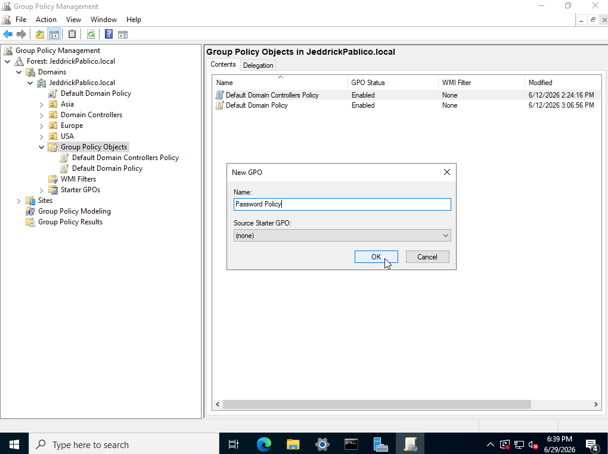

<i>Figure 2.1.1: Establishing a new GPO for password security.</i>

**2.1.2** Right-click the newly created `Password Policy` GPO and select **Edit**. Navigate to: **Computer Configuration > Policies > Windows Settings > Security Settings > Account Policies > Password Policy**.

  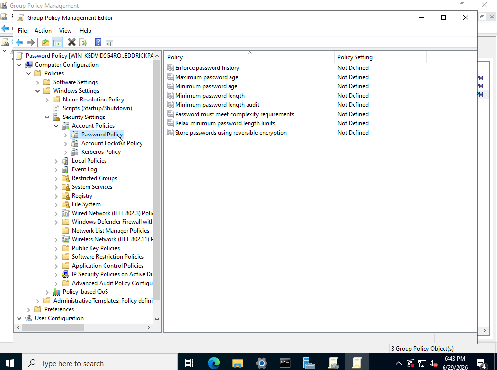

<i>Figure 2.1.2: Locating the Password Policy configurations within the GPO Editor.</i>

**2.1.3** Double-click the policies in the right pane to enforce security standards:
* **Minimum password length:** Click the checkbox for _Define this policy_ and set it to `12 characters`.
* **Password must meet complexity requirements:** Set to `Enabled`.
* **Maximum password age:** Define this policy and set it to `90 days`.
Click **Apply** and **OK** for each setting.

> ⚠️ **Enterprise Context: Legacy Expirations vs. Modern Standards**
> While setting a 90-day password rotation is a classic IT practice included in this lab, modern cybersecurity frameworks (like NIST 800-63B) now recommend *against* arbitrary password expiration. Frequent forced changes lead to "password fatigue," where users simply append a number to the end of their old password (e.g., `Password1!`, `Password2!`), which is easily guessed by threat actors. Modern enterprise environments prefer longer passphrases (15+ characters) alongside Multi-Factor Authentication (MFA), only requiring a change if a breach is suspected.

### 2.2 Network Drive Mapping (User Configuration -> Preference)

*This preference automatically connects client machines to shared network storage locations upon user login, ensuring employees have immediate access to their departmental files without manual configuration.*

**2.2.1** Right-click the **Group Policy Objects** folder (or directly on your domain) and select **New**. Create a new GPO named `Drive Mapping`. Right-click on the new GPO and select **Edit**.

  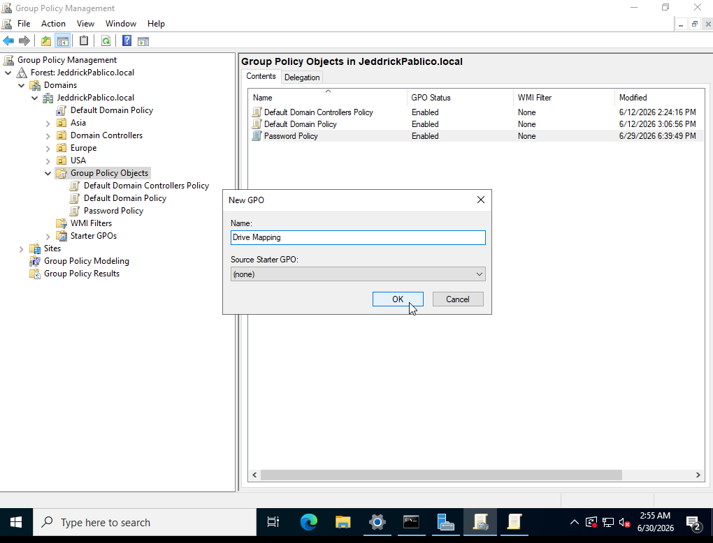

<i>Figure 2.2.1: Right-clicking to edit the newly created Drive Mapping GPO.</i>

**2.2.2** Navigate to: **User Configuration > Preferences > Windows Settings > Drive Maps**.

  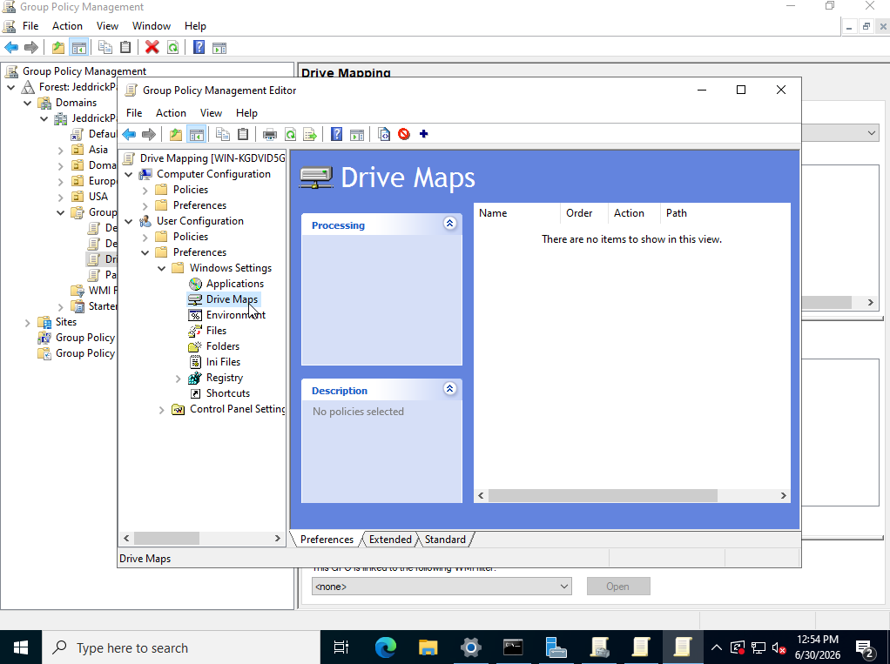

<i>Figure 2.2.2: Locating the Drive Maps setting.</i>

**2.2.3** Right-click in the empty pane, select **New**, then **Mapped Drive**.

  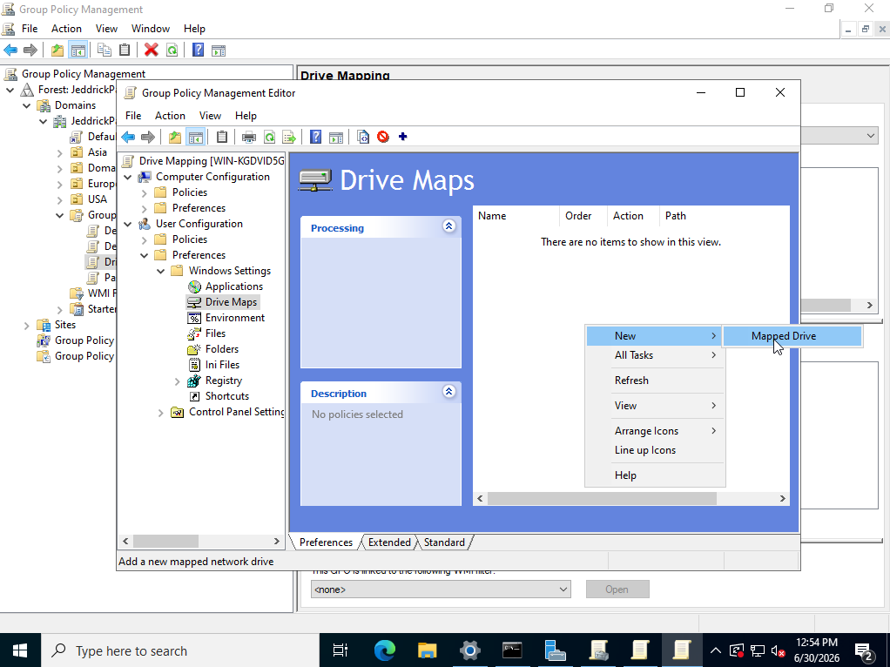

<i>Figure 2.2.3: Initiating a new mapped drive configuration.</i>

**2.2.4** Choose a Drive Letter (e.g., `E:`) and input the network share location path (e.g., `\\servername\foldername`). Click **Apply** and **OK**.

  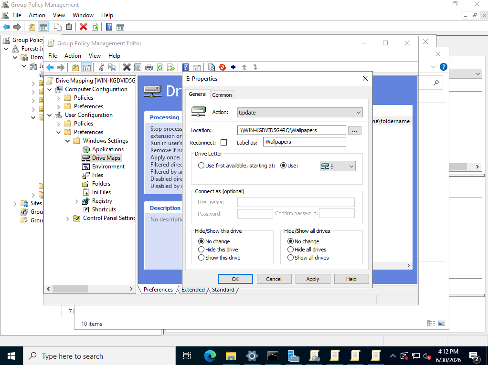

<i>Figure 2.2.4: Defining the drive letter and shared network path.</i>

> ⏭️ **Upcoming Lab Module: Advanced File & Print Services**
> *Note: This section demonstrates a basic, surface-level drive mapping execution. A comprehensive, dedicated tutorial covering advanced File Server management, NTFS permissions, and complex drive mapping architectures will be published in a future repository update.*
> 
> ⚠️ **Enterprise Context: Hardcoded IPs and Item-Level Targeting**
> In a real-world application, mapping a drive to a direct server name or IP (e.g., `\\FileServer01\HR`) is a single point of failure. If that server goes down, everyone loses access. Enterprises use **DFS (Distributed File System) Namespaces** (e.g., `\\JeddrickPablico.local\CompanyShares`), which automatically route users to the nearest healthy server. Additionally, administrators use "Item-Level Targeting" within this GPO to ensure the HR drive is only mapped if the logged-in user belongs to the "HR Security Group."

### 2.3 Desktop Wallpaper Policy (User Configuration -> Policy)

*This policy standardizes the visual environment across all corporate workstations by forcing a specific background image, typically utilizing a company logo or an acceptable use policy.*

**2.3.1** Right-click the **Group Policy Objects** folder (or directly on your domain) and select **New**. Create a new GPO named `Desktop Wallpaper`. Right-click on the new GPO and select **Edit**. 

  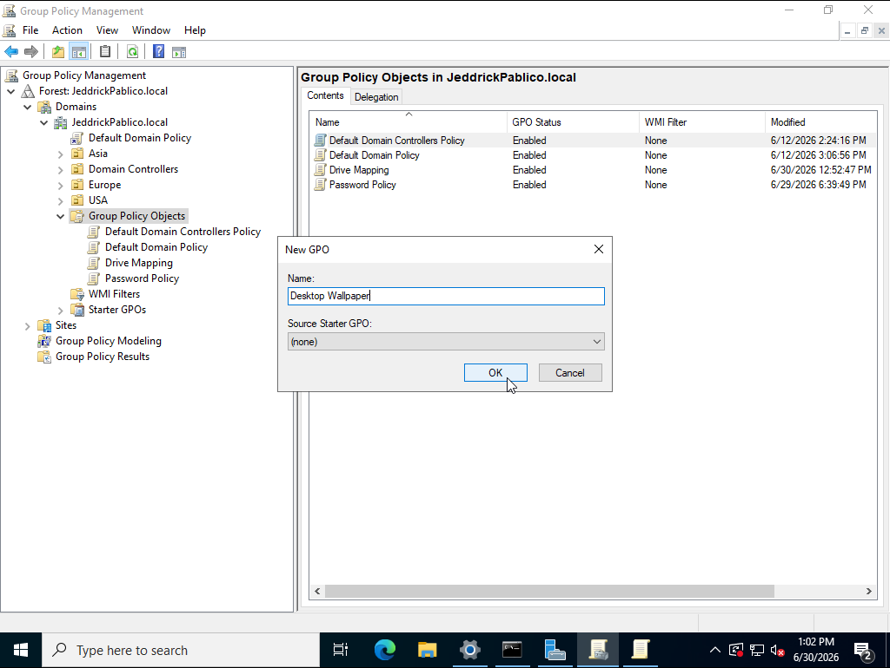

<i>Figure 2.3.1: Opening the Desktop Wallpaper Group Policy Object for editing.</i>

**2.3.2** Navigate to: **User Configuration > Policies > Administrative Templates > Desktop > Desktop**. 

  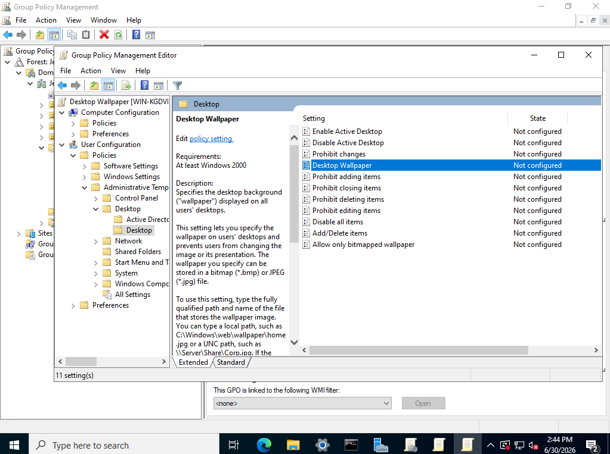

<i>Figure 2.3.2: Locating the administrative template for desktop backgrounds.</i>

**2.3.3** Double-click **Desktop Wallpaper**. Select **Enabled**. Specify the exact path where the image is stored under **Wallpaper Name**, set the **Wallpaper Style** to your desire, and click **OK**.

  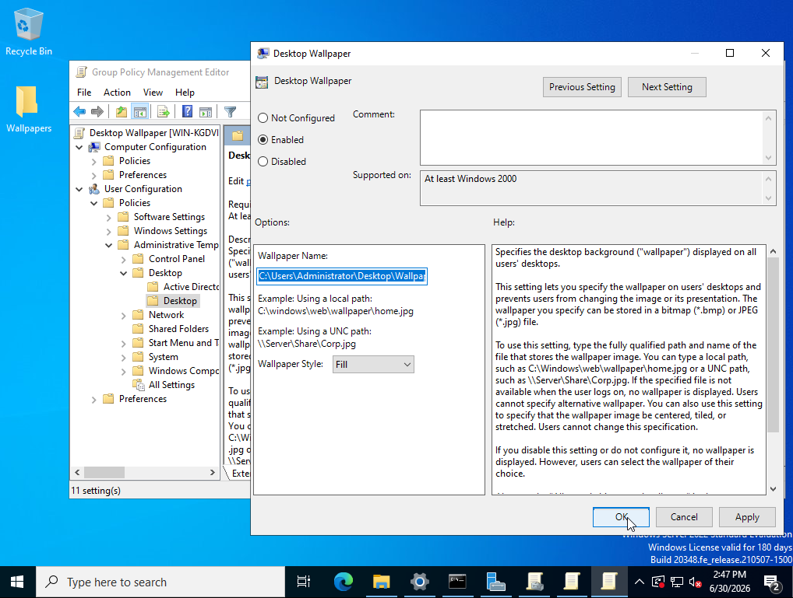

<i>Figure 2.3.3: Configuring the wallpaper path and display style.</i>

> ⚠️ **Enterprise Context: The Network Path Trap**
> A common mistake is pointing the GPO wallpaper path to a local drive (e.g., `C:\Images\logo.jpg`). When the policy deploys, the client machine will look for that file on *its own* C: drive, fail to find it, and present a black screen. To work in production, the wallpaper must be hosted on a highly available network share that all computers have "Read" access to—typically the Domain Controller's built-in `SYSVOL` folder.

### 2.4 Restrict Control Panel Access (User Configuration -> Policy)

*This policy prevents standard users from altering core system configurations, such as network adapter settings, installed software, or user account controls.*

**2.4.1** Right-click the **Group Policy Objects** folder (or directly on your domain) and select **New**. Create a new GPO named `Restrict Control Panel`. Right-click on the new GPO and select **Edit**.

  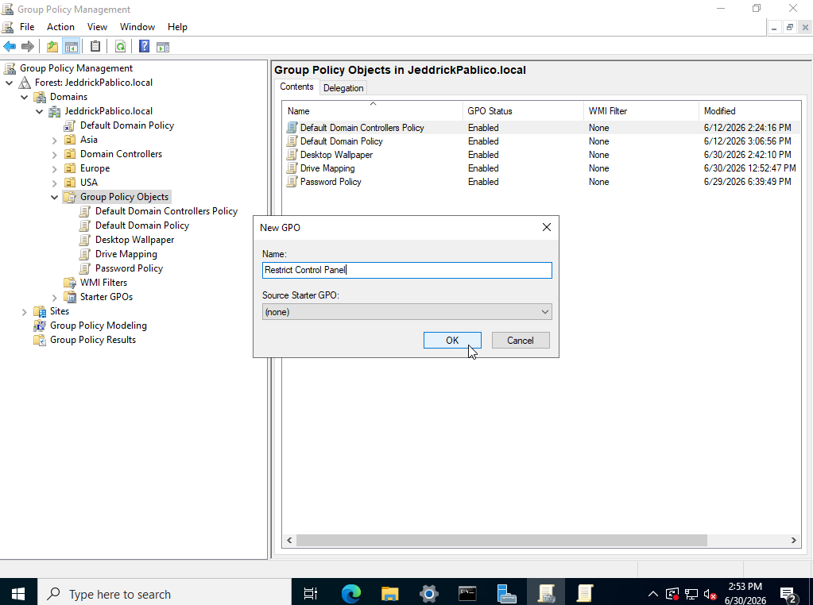

<i>Figure 2.4.1: Initiating the Control Panel restriction policy.</i>

**2.4.2** Navigate to: **User Configuration > Policies > Administrative Templates > Control Panel**.

  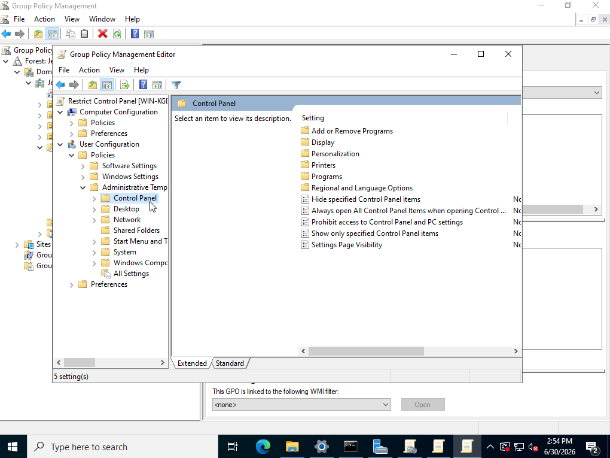

<i>Figure 2.4.2: Locating the Control Panel restrictions section.</i>

**2.4.3** Double-click **Prohibit access to Control Panel and PC settings**. Select **Enabled**, click **Apply**, and **OK**. This locks standard users out of critical system configurations.

  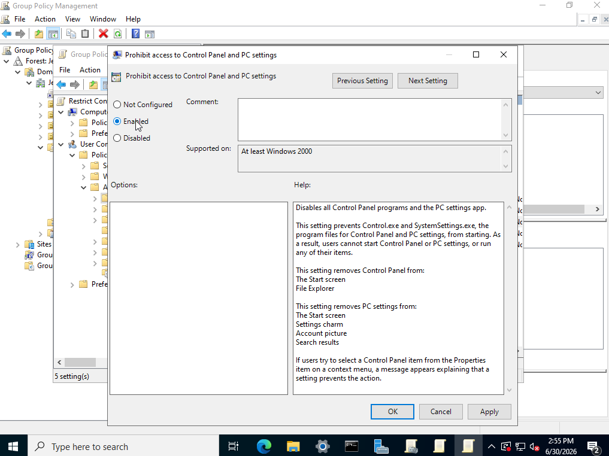

<i>Figure 2.4.3: Enforcing the Control Panel access block.</i>

> ⚠️ **Enterprise Context: Mitigating Shadow IT**
> Unrestricted local admin and Control Panel access is one of the leading causes of Helpdesk tickets. If users can change IP settings, disable their firewalls, or uninstall antivirus software, they create massive security vulnerabilities and network instability. Restricting this access ensures that environments remain uniform, compliant, and manageable.

### 2.5 Disable USB Devices (Computer Configuration -> Policy)

*This strict security policy disables the ability for endpoints to mount external flash drives or hard drives, neutralizing physical vectors for data theft or malware insertion.*

**2.5.1** Right-click the **Group Policy Objects** folder (or directly on your domain) and select **New**. Create a new GPO named `Disable USB Devices`. Right-click on the new GPO and select **Edit**. 

  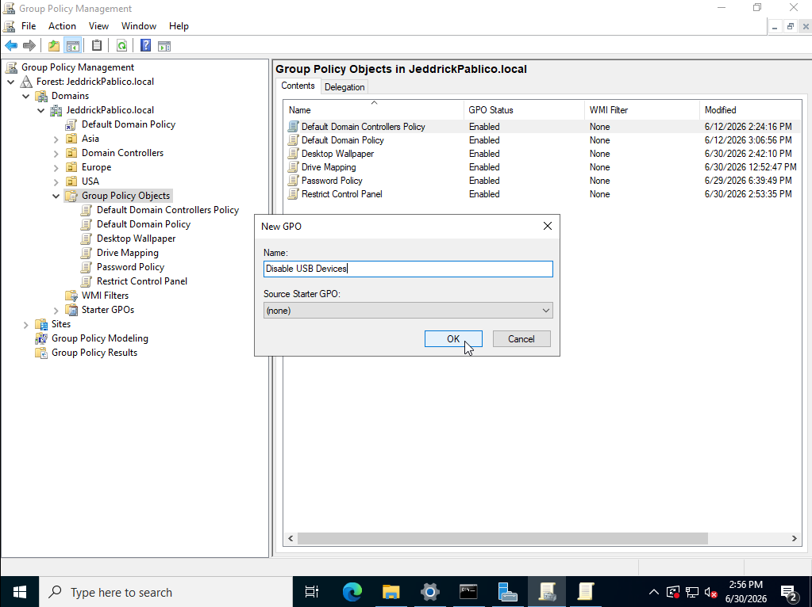

<i>Figure 2.5.1: Initiating the removable storage restriction policy.</i>

**2.5.2** Navigate to: **Computer Configuration > Policies > Administrative Templates > System > Removable Storage Access**.

  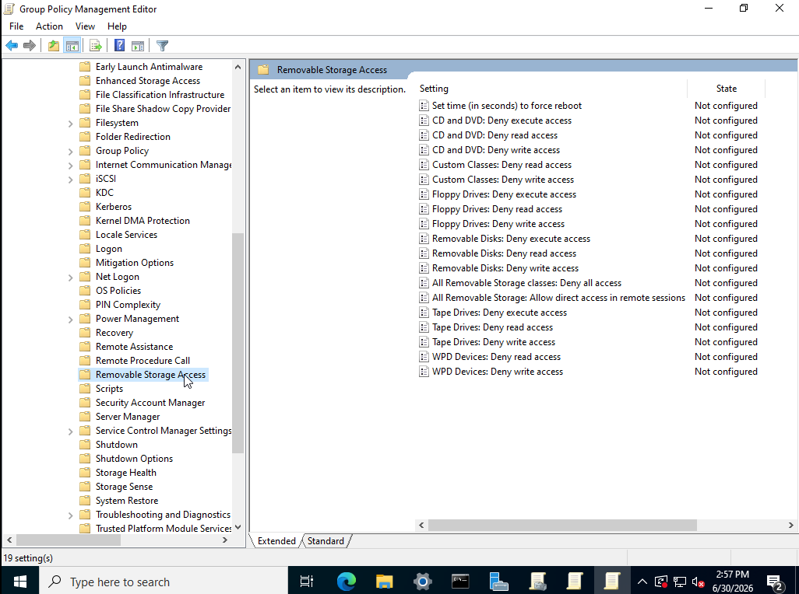

<i>Figure 2.5.2: Locating the system rules for removable media.</i>

**2.5.3** Double-click **All Removable Storage classes: Deny all access**. Select **Enabled**, click **Apply**, and **OK**. This secures endpoints against unauthorized flash drives and data exfiltration.

  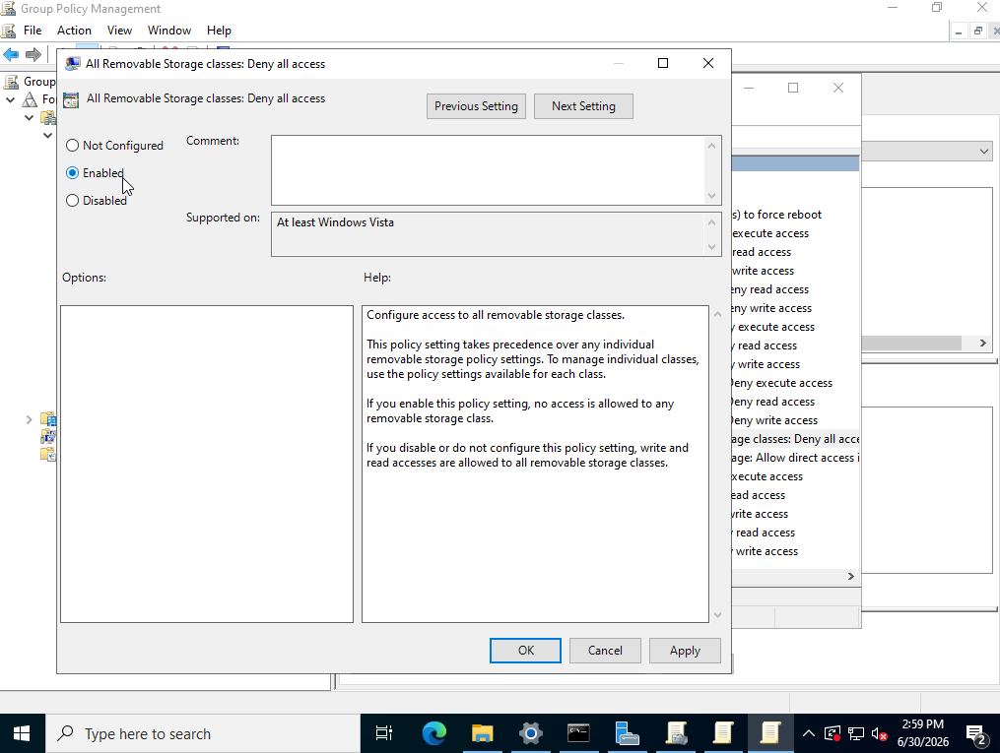

<i>Figure 2.5.3: Enforcing a blanket block on all USB storage devices.</i>

> ⚠️ **Enterprise Context: The "BadUSB" Threat vs. Granular Control**
> USB drives are a massive vector for ransomware, malware (like "BadUSB" devices that emulate keyboards to inject malicious code), and corporate data exfiltration. While a blanket GPO block works for a lab, it is often too disruptive for business operations. In enterprise environments, this is typically handled by advanced Endpoint Detection and Response (EDR) software, which allows IT to block unknown devices but whitelist specific, company-issued, hardware-encrypted USB drives.

## 🛠️ Phase 3: Linking GPOs to Target Organizational Units (OUs)

In the [previous tutorial](https://github.com/jeddrickpablico/ActiveDirectoryProjects/blob/main/DomainControllerInstallationAndSetup.md), we architected a logical hierarchy using Organizational Units (OUs) to represent distinct departments (e.g., IT, HR, Sales) and provisioned manual user accounts. We must now link the GPOs we created to these appropriate OUs so the configurations take effect. This is accomplished by dragging and dropping the GPOs within the GPMC.

### 3.1 Applying Computer Configuration GPOs

**3.1.1** Computer configurations must be linked directly to the OUs containing the actual computer objects. Click the `Password Policy` GPO in the _Group Policy Objects_ folder and drag and drop it onto your target **Computer OU** (e.g., within the USA region).

  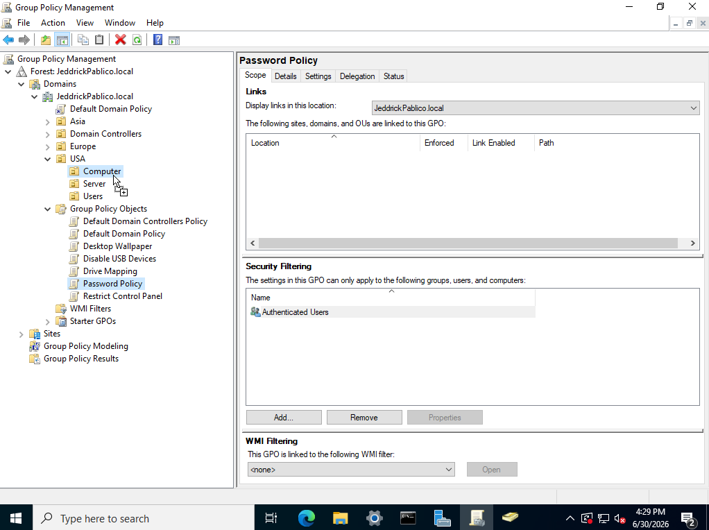

<i>Figure 3.1.1: Applying the computer configuration policy to the appropriate container.</i>

**3.1.2** Select **OK** when prompted to confirm the link.

  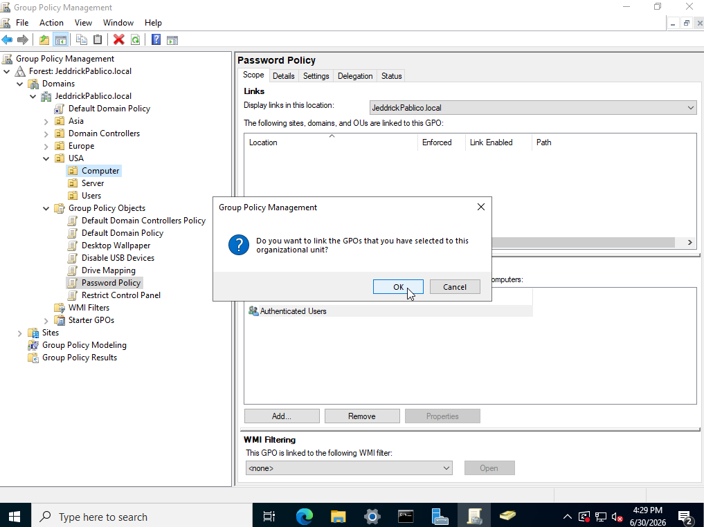

<i>Figure 3.1.2: Acknowledging the prompt to link the GPO to the OU.</i>

**3.1.3** Repeat this process for the `Disable USB Devices` GPO, dragging it to the **Computer OU** as well. You will know this is successful when you can see the policies listed under the target OU.

  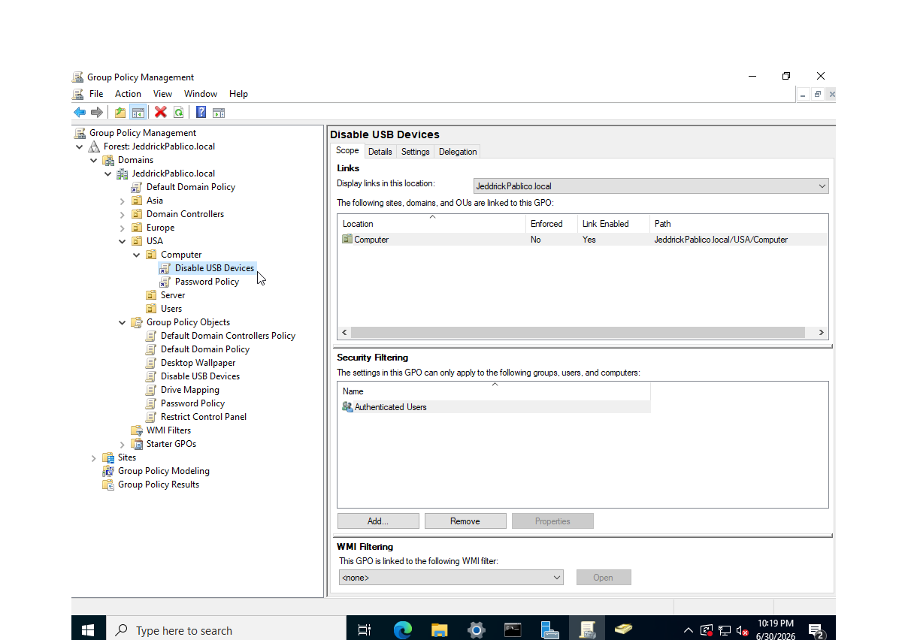

<i>Figure 3.1.3: Confirming the successful deployment of the Group Policy Objects.</i>

> ⚠️ **Enterprise Security Risk: The Password Policy Trap & Domain Roots**
> In this lab sequence, we linked the Password Policy to a specific Computer OU. **In a real-world Active Directory environment, this is a major security operational trap.** A legacy Password Policy GPO linked to a specific OU *only affects the local user accounts* on those machines, NOT the domain users logging into them! To enforce password complexity for domain identities, the policy MUST be linked at the very root of the Domain (e.g., `JeddrickPablico.local`), usually via the **Default Domain Policy**. 
> 
> Furthermore, modern enterprises largely bypass this limitation by utilizing **Fine-Grained Password Policies (FGPP)**, which allows network engineers to assign different password rules to different security groups (e.g., Domain Admins require 16 characters and MFA, while Standard Users require 12).

### 3.2 Applying User Configuration GPOs

**3.2.1** User configurations follow the employee profile, so they must be linked to the OUs containing the actual user accounts. Drag and drop the `Restrict Control Panel`, `Drive Mapping`, and `Desktop Wallpaper` GPOs directly onto the **Users OU**.

  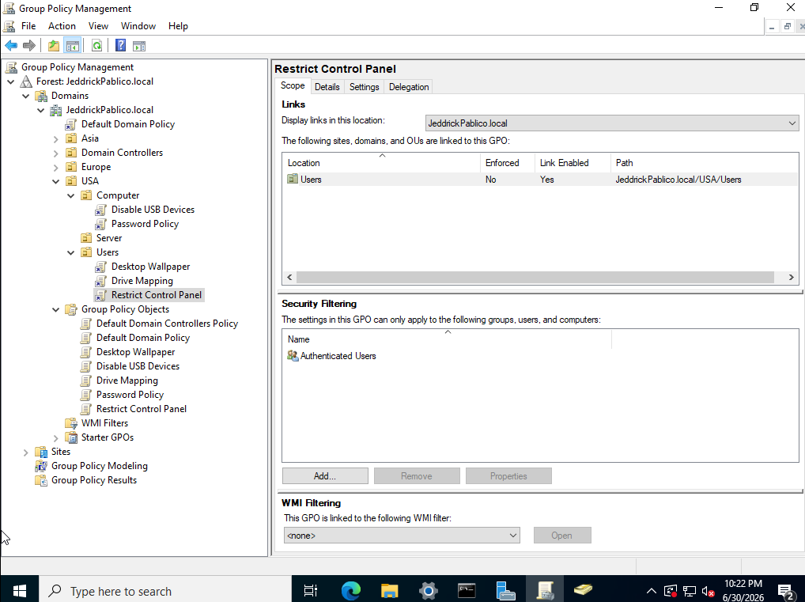

<i>Figure 3.2.1: Deploying user-centric policies and preferences to the employee directory.</i>

**3.2.2** Select **OK** for each prompt to confirm the links.

> ⚠️ **Enterprise Context: Security Filtering vs. OU Linking**
> Aligning with the Principle of Least Privilege, linking a GPO to a blanket OU is often too broad for production networks. For example, you might want to restrict the Control Panel for standard employees but leave it accessible for Helpdesk staff residing in the exact same OU. Instead of architecting overly complex OU structures to separate these users, administrators use **Security Filtering**. They link the GPO to the OU, remove "Authenticated Users" from the policy's scope, and add a specific targeted Security Group (e.g., `SG-Standard-Employees`).

---

## 💻 Phase 4: Object Management & Validation

### 4.1 Moving the Client Computer Object

When a new computer is joined to the domain, Active Directory places it into the generic `Computers` container by default. Because Group Policies cannot be linked to default containers, your Computer GPOs will fail to apply until this object is physically moved.

**4.1.1** Open Server Manager. Click **Tools** and select **Active Directory Users and Computers (ADUC)**.

  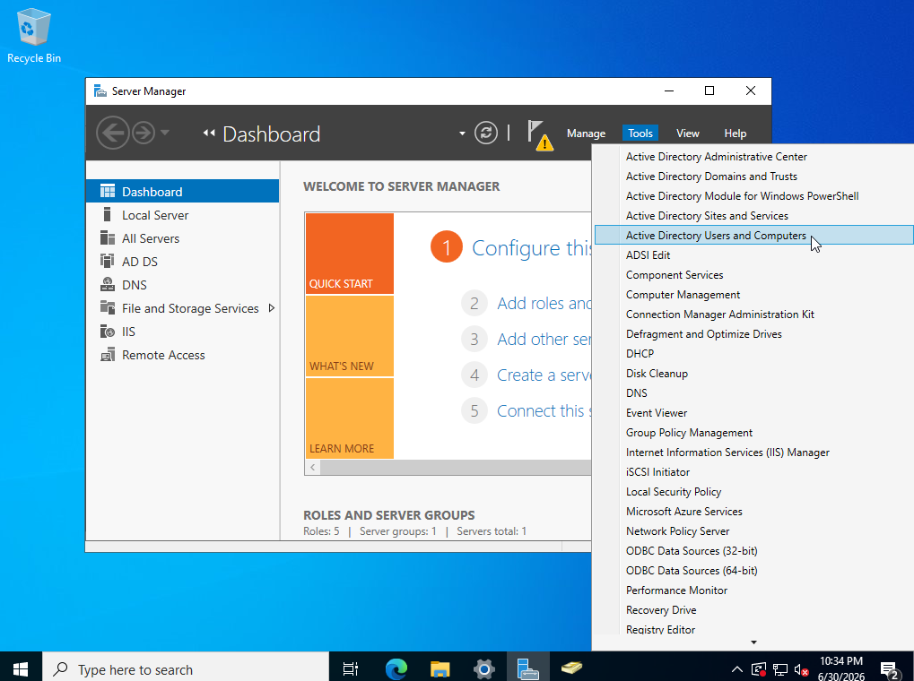

<i>Figure 4.1.1: Navigating to ADUC to locate the newly joined client machine.</i>

**4.1.2** Click the default `Computers` folder, right-click the newly joined client computer object, click **Move**, and select your target `USA > Computers` OU. Click **OK**.

  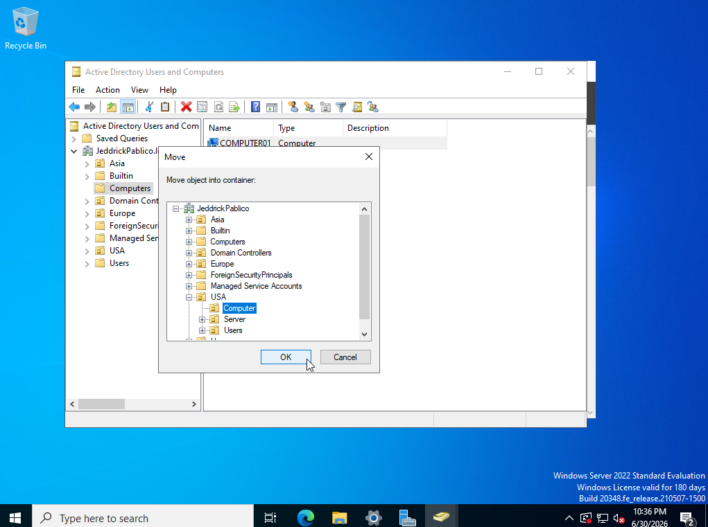

<i>Figure 4.1.2: Relocating the computer object to ensure GPOs apply correctly.</i>

**4.1.3** Once moved, it is highly recommended as an enterprise best practice to immediately add a description to the computer object's properties to maintain accurate inventory tracking and auditing.

> ⚠️ **Enterprise Security Risk: The Default Container & Stale Objects**
> Relying on manual object moves in a large enterprise leads to unpatched, insecure machines sitting indefinitely in the default container because a technician forgot to move them. System administrators solve this by executing the command `redircmp OU=Computers,OU=USA,DC=JeddrickPablico,DC=local`. This permanently changes the default landing zone for all newly joined computers to a heavily secured OU, ensuring compliance from the exact moment the machine touches the network.
> 
> Additionally, "stale" computer objects left in AD can be leveraged by threat actors to forge Kerberos tickets or mask lateral movement. Routine auditing scripts must be implemented to disable inactive computer accounts.

### 4.2 Forcing the Policy Update

**4.2.1** Switch to your domain-joined client machine. By default, Windows refreshes Group Policy settings on a randomized 90-minute cycle. 

  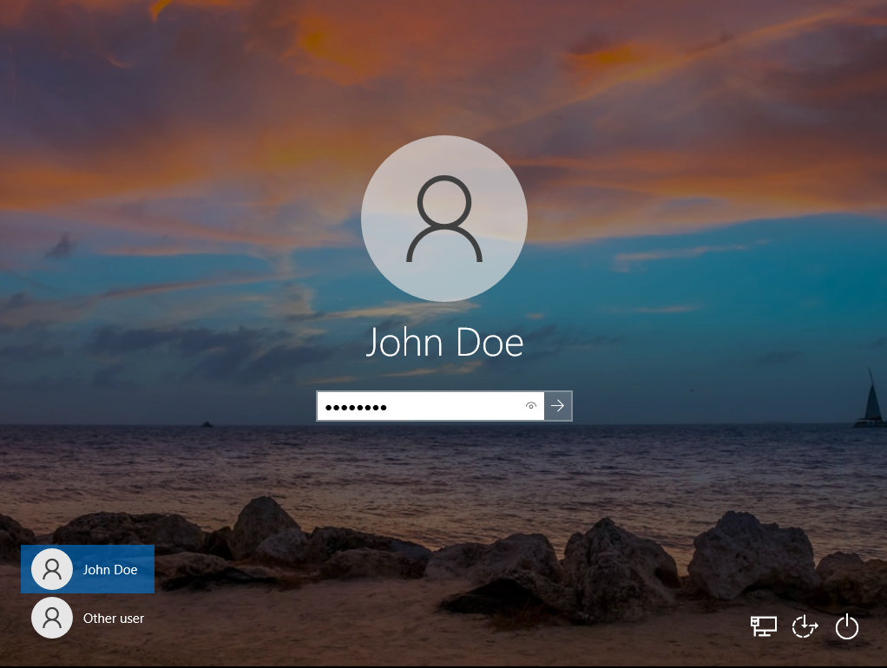

<i>Figure 4.2.1: Accessing the client endpoint with a standard user account.</i>

**4.2.2** To bypass this delay and test immediately, open the Command Prompt (CMD).

  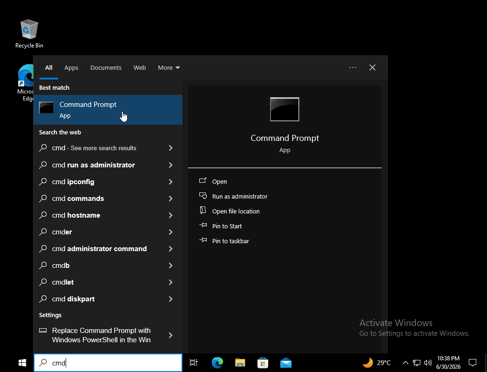

<i>Figure 4.2.2: Accessing the command line on the client endpoint.</i>

**4.2.3** Type `gpupdate /force` and press **Enter** to instantly pull the latest configuration from the Domain Controller. Wait for the success confirmation.

  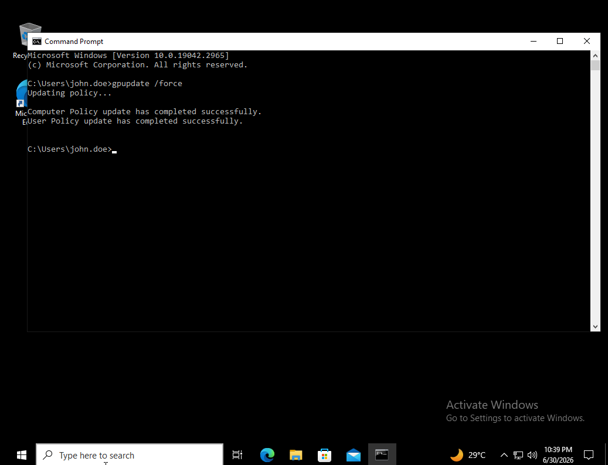

<i>Figure 4.2.3: Forcing the client machine to immediately evaluate Active Directory policies.</i>

**4.2.4** To test if the policies successfully applied, attempt to open the Control Panel. If configured correctly, you will see an error message and be blocked from accessing it.

  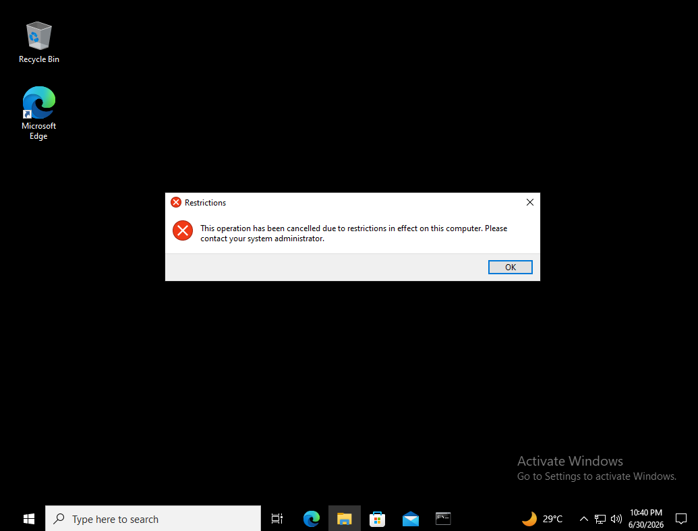

<i>Figure 4.2.4: Successful validation that the Group Policy Object is actively restricting the user.</i>

> ⚠️ **Enterprise Context: Troubleshooting with GPResult**
> When a policy fails to apply in the real world, administrators do not guess. They open an elevated command prompt on the client and run `gpresult /r` (or export it to a file using `gpresult /h report.html`). This command generates a detailed diagnostic report showing exactly which GPOs were successfully applied, which were filtered out, and which Domain Controller the machine authenticated against. Additionally, they will audit the Windows Event Viewer (specifically Event IDs 1502 and 1054) to pinpoint exact failure states in the GPO application chain.
